# Instructor Course Builder: Step-by-Step Flow (Backend-Aligned)

This guide explains how to design an instructor course-builder UI that matches the current backend.
It is based on the project models, serializers, URLs, and lifecycle rules.

Base URL prefix for all endpoints in this doc:
`/api/v1/courses/`

## Table of Contents

1. [Prerequisites and Permissions](#1-prerequisites-and-permissions)
2. [Create Draft Course (Core Info)](#2-create-draft-course-core-info)
3. [Edit and Autosave Course Metadata](#3-edit-and-autosave-course-metadata)
4. [Build Curriculum Sections](#4-build-curriculum-sections)
5. [Add Content Items Through Unified Curriculum Endpoint](#5-add-content-items-through-unified-curriculum-endpoint)
6. [Lecture Authoring Flow](#6-lecture-authoring-flow)
7. [Quiz Authoring Flow](#7-quiz-authoring-flow)
8. [Assignment Authoring Flow](#8-assignment-authoring-flow)
9. [Coding Exercise Authoring Flow](#9-coding-exercise-authoring-flow)
10. [Reorder Curriculum Items](#10-reorder-curriculum-items)
11. [Submission Readiness Checks (Critical)](#11-submission-readiness-checks-critical)
12. [Admin Review, Publish, Reject, Rework, Archive, Restore](#12-admin-review-publish-reject-rework-archive-restore)
13. [Recommended Builder UI Stepper (Practical Product Flow)](#13-recommended-builder-ui-stepper-practical-product-flow)
14. [Field Checklist by Content Type (Quick Reference)](#14-field-checklist-by-content-type-quick-reference)
15. [Error Handling Contract for Builder](#15-error-handling-contract-for-builder)
16. [Implementation Notes from Current Backend Design](#16-implementation-notes-from-current-backend-design)

## 1) Prerequisites and Permissions

Before allowing course creation in UI:

- User must be authenticated.
- User email must be verified.
- User must be a verified instructor.

Relevant permission path in backend:
- `IsAuthenticated + IsEmailVerified + IsVerifiedInstructor`

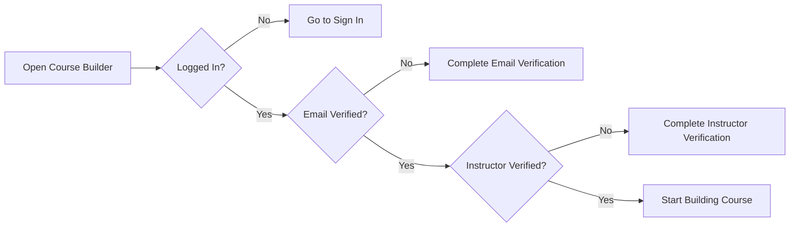

---

## 2) Create Draft Course (Core Info)

Endpoint:
- `POST create/`

Primary fields for creation/update (`NidusCourseCreateUpdateSerializer`):

- `title` (required, min 5 chars)
- `description` (recommended at create time; mandatory before submit)
- `thumbnail` (optional image)
- `price` (optional, decimal, min 0)
- `language` (optional, default: `English`)
- `level` (optional: `beginner|intermediate|advanced`)
- `duration_minutes` (optional)
- `category` (optional, active category id)
- `instructors` (optional list of instructor user ids)
- `partner_institutions` (optional list of partner institution ids)
- `learning_objectives` (optional list of `{text, display_order}`)
- `prerequisites` (optional list of `{text, display_order}`)
- `audiences` (optional list of `{text, display_order}`)

Auto-managed by backend:
- `status` starts as `draft`
- creator is automatically included in `instructors`
- `slug` auto-generated from title

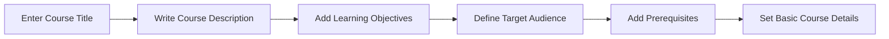

---

## 3) Edit and Autosave Course Metadata

Suggested UI sections:

- Basic Info: title, description, thumbnail, price, language, level, duration
- Taxonomy: category
- Team: instructors, partner institutions
- Outcomes: learning objectives
- Entry Bar: prerequisites
- Audience: audiences

Endpoints:
- `PATCH <course_id>/`
- Optional granular list/create/update/delete endpoints:
  - `<course_id>/learning-objectives/`, `learning-objectives/<item_id>/`
  - `<course_id>/prerequisites/`, `prerequisites/<item_id>/`
  - `<course_id>/audiences/`, `audiences/<item_id>/`

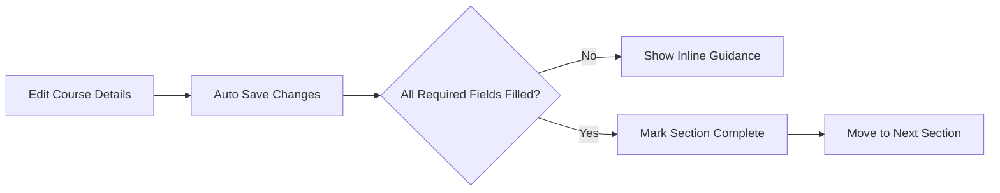

---

## 4) Build Curriculum Sections

Endpoints:
- `POST <course_id>/sections/create/`
- `GET <course_id>/sections/`
- `PATCH sections/<section_id>/`
- `DELETE sections/<section_id>/`

Section fields:
- `title` (required, min 2 chars)
- `description` (optional)
- `position` (required in payload strategy; unique per course)

Builder behavior recommendation:
- keep sections ordered
- use explicit drag/drop reorder logic by updating positions

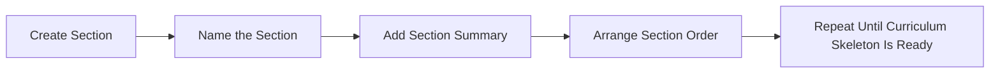

---

## 5) Add Content Items Through Unified Curriculum Endpoint

Primary endpoint (recommended):
- `POST sections/<section_id>/contents/`

This creates both:
- concrete content object (Lecture/Quiz/Assignment/CodingExercise)
- `SectionContent` row for ordering

`content_type` options:
- `lecture`
- `quiz`
- `assignment`
- `coding`

`SectionContent` is the single source of truth for order inside a section.

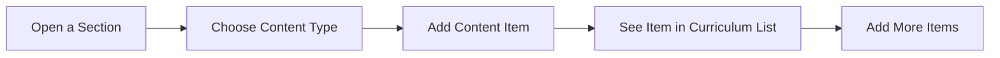

---

## 6) Lecture Authoring Flow

Endpoints:
- `GET sections/<section_id>/lectures/`
- `PATCH lectures/<lecture_id>/`
- `DELETE lectures/<lecture_id>/`

Create/update fields (`LectureCreateUpdateSerializer`):
- `title` (required, min 2 chars)
- `lecture_type` (required: `video|article`)
- `is_preview` (optional bool)
- `article_content` (required if `lecture_type=article`)
- `video_file` (required on create if `lecture_type=video`)

Validation rules:
- Article lecture cannot include `video_file`.
- Video lecture cannot include `article_content`.
- Video replacement triggers new processing job.

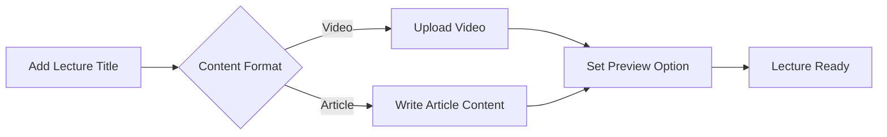

---

## 7) Quiz Authoring Flow

Endpoints:
- `PATCH quizzes/<quiz_id>/`
- `GET/POST quizzes/<quiz_id>/questions/`
- `PATCH/DELETE quiz-questions/<question_id>/`
- `GET/POST quiz-questions/<question_id>/answers/`
- `PATCH/DELETE quiz-answers/<answer_id>/`

Quiz fields:
- `title` (required, min 2 chars)
- `description` (optional)

Question fields:
- `question_text` (required)
- `position` (ordered per quiz [auto created])

Answer fields:
- `answer_text` (required)
- `is_correct` (bool)

Constraint:
- only one correct answer per question

Quiz format for frontend:
- Quizzes are MCQ-based.
- Each question contains multiple options.
- Exactly one option is marked as correct.
- In learner view, show options only (do not expose the correct-answer flag).

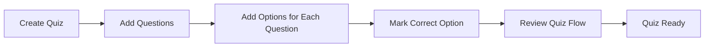

---

## 8) Assignment Authoring Flow

Endpoints:
- `GET/POST sections/<section_id>/assignments/`
- `PATCH/DELETE assignments/<assignment_id>/`
- `GET/POST assignments/<assignment_id>/questions/`
- `PATCH/DELETE assignment-questions/<question_id>/`
- `PATCH assignments/<assignment_id>/questions/reorder/`

Assignment fields:
- `title` (required, min 2 chars)
- `description` (optional)
- `instructions` (optional)
- `passing_score` (optional number)

Assignment question fields:
- `question_text` (required)
- `model_answer` (instructor-only)
- `points`
- `hint`
- `position` (auto-managed on create, reorder endpoint available)

Assignment types (recommended frontend patterns):
- Essay assignment (single long-form response):
  - Use one question item with a detailed essay prompt in `question_text`.
  - Use `model_answer` for rubric/sample outline.
  - Keep total marks in that question's `points`.
- Multi-question assignment (several structured questions):
  - Add multiple question items.
  - Each question has its own `points` and optional `hint`.
  - Reorder questions to control assessment flow.

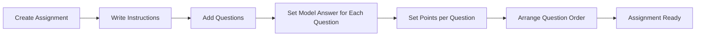

---

## 9) Coding Exercise Authoring Flow

Endpoints:
- `PATCH/DELETE coding-exercises/<exercise_id>/`
- `GET/POST coding-exercises/<exercise_id>/language-configs/`
- `PATCH/DELETE coding-exercises/<exercise_id>/language-configs/<config_id>/`
- `GET/POST coding-exercises/<exercise_id>/testcases/`
- `PATCH/DELETE coding-exercises/<exercise_id>/testcases/<tc_id>/`

Coding exercise fields:
- `title` (required, min 3 chars)
- `description` (optional)
- `problem_statement` (required)
- `difficulty` (`easy|medium|hard`)
- `default_language`
- `supported_languages` (required non-empty list from allowed set)
- `time_limit_ms`

Rules:
- `default_language` must be included in `supported_languages`

Language config fields:
- `language`
- `starter_code`
- `solution_code` (instructor-side sensitive)

Test case fields:
- `input_data`
- `expected_output`
- `is_hidden`
- `explanation`
- `position`

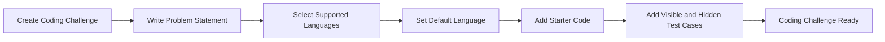

---

## 10) Reorder Curriculum Items

Endpoint:
- `PATCH contents/<content_id>/reorder/`

Purpose:
- move any mixed item type (`lecture/quiz/assignment/coding`) within section order
- backend shifts neighbor items atomically and keeps unique positions

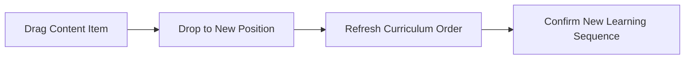

---

## 11) Submission Readiness Checks (Critical)

Endpoint:
- `POST <course_id>/submit/`

Course can move `draft -> under_review` only if all checks pass:

- non-empty `title`
- non-empty `description`
- at least one section
- every section has at least one content item
- all active video assets are `ready`
- each quiz has at least one question
- each quiz question has at least one correct answer

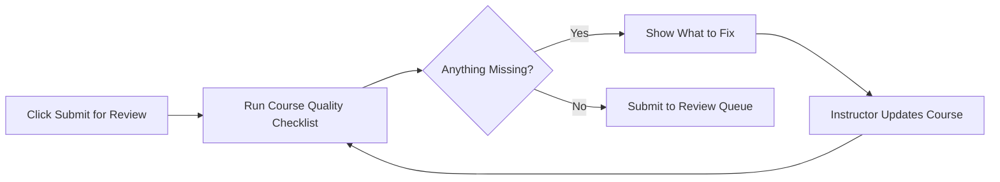

---

## 12) Admin Review, Publish, Reject, Rework, Archive, Restore

Status machine:
- `draft -> under_review`
- `under_review -> published | rejected`
- `rejected -> draft` (rework)
- `published -> archived`
- `archived -> draft` (restore)

Endpoints:
- `POST <course_id>/review/` (`action=approve|reject`, rejection requires reason)
- `POST <course_id>/rework/`
- `POST <course_id>/archive/`
- `POST <course_id>/restore/`

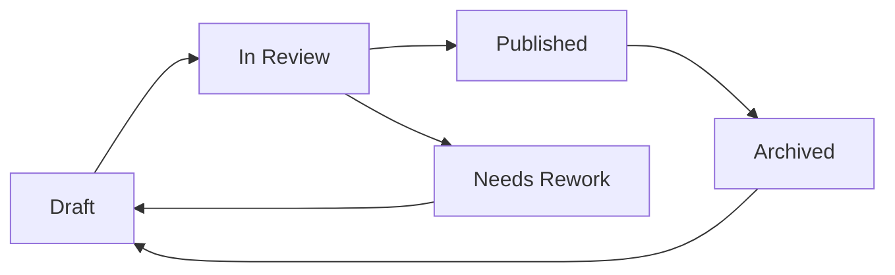

---

## 13) Recommended Builder UI Stepper (Practical Product Flow)

Suggested wizard sequence:

1. Course Basics
2. Outcomes & Audience
3. Pricing & Publishing Metadata
4. Sections
5. Curriculum Items
6. Type-Specific Authoring (Lecture/Quiz/Assignment/Coding)
7. Reorder & QA
8. Submit for Review

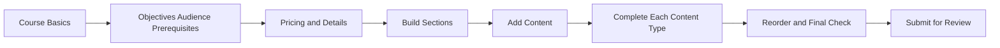

---

## 14) Field Checklist by Content Type (Quick Reference)

### Course
- `title`, `description`, `thumbnail`, `price`, `language`, `level`, `duration_minutes`, `category`, `instructors`, `partner_institutions`
- arrays: `learning_objectives[]`, `prerequisites[]`, `audiences[]`

### Section
- `title`, `description`, `position`
@
### Lecture
- `title`, `lecture_type`, `is_preview`, (`article_content` OR `video_file`)

### Quiz
- quiz: `title`, `description`
- question: `question_text`, `position`
- answer: `answer_text`, `is_correct`

### Assignment
- assignment: `title`, `description`, `instructions`, `passing_score`
- question: `question_text`, `model_answer`, `points`, `hint`, `position`

### Coding Exercise
- exercise: `title`, `description`, `problem_statement`, `difficulty`, `default_language`, `supported_languages`, `time_limit_ms`
- language config: `language`, `starter_code`, `solution_code`
- testcase: `input_data`, `expected_output`, `is_hidden`, `explanation`, `position`

---

## 15) Error Handling Contract for Builder

Design UI error handling to support:

- field-level validation errors from serializers
- lifecycle errors from transition guards
- completeness errors on submit as a dictionary keyed by area

Best UX behavior:
- keep user on same step
- highlight invalid fields/sections directly
- maintain unsaved editor buffers where possible

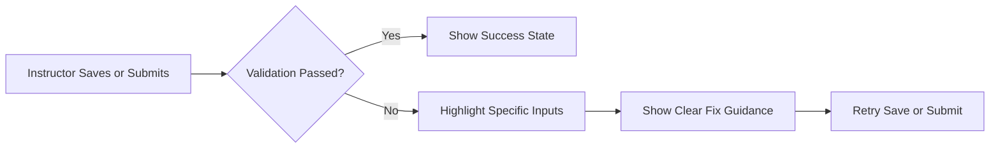

---

## 16) Implementation Notes from Current Backend Design

- Ordering is centralized in `SectionContent`; content models do not own curriculum position.
- Deleting lecture/quiz/assignment/coding item cascades and removes its `SectionContent` row.
- Video processing is asynchronous and blocks submission until all active assets are `ready`.
- Course editability is tied to status (`draft` and `rejected` are editable states).

This means your builder should treat:
- curriculum ordering as one shared drag-and-drop layer,
- content-type editors as modular sub-forms,
- submission as a strict validation gate.
