# Instructor Course Builder: Step-by-Step Flow (Backend-Aligned)

This guide explains how to design an instructor course-builder UI that matches the current backend.
It is based on the project models, serializers, URLs, and lifecycle rules.

Base URL prefix for all endpoints in this doc:
`/api/v1/courses/`

## Table of Contents

1. [Prerequisites and Permissions](#1-prerequisites-and-permissions)
2. [Create Draft Course (Core Info)](#2-create-draft-course-core-info)
3. [Edit and Autosave Course Metadata](#3-edit-and-autosave-course-metadata)
4. [Build Curriculum Sections](#4-build-curriculum-sections)
5. [Add Content Items Through Unified Curriculum Endpoint](#5-add-content-items-through-unified-curriculum-endpoint)
6. [Lecture Authoring Flow](#6-lecture-authoring-flow)
7. [Quiz Authoring Flow](#7-quiz-authoring-flow)
8. [Assignment Authoring Flow](#8-assignment-authoring-flow)
9. [Coding Exercise Authoring Flow](#9-coding-exercise-authoring-flow)
10. [Reorder Curriculum Items](#10-reorder-curriculum-items)
11. [Submission Readiness Checks (Critical)](#11-submission-readiness-checks-critical)
12. [Admin Review, Publish, Reject, Rework, Archive, Restore](#12-admin-review-publish-reject-rework-archive-restore)
13. [Co-instructor Invitation Workflow](#13-co-instructor-invitation-workflow)
14. [Recommended Builder UI Stepper (Practical Product Flow)](#14-recommended-builder-ui-stepper-practical-product-flow)
15. [Field Checklist by Content Type (Quick Reference)](#15-field-checklist-by-content-type-quick-reference)
16. [Error Handling Contract for Builder](#16-error-handling-contract-for-builder)
17. [Implementation Notes from Current Backend Design](#17-implementation-notes-from-current-backend-design)

## 1) Prerequisites and Permissions

Before allowing course creation in UI:

- User must be authenticated.
- User email must be verified.
- User must be a **verified instructor** OR a **verified active partner institution**.

Relevant permission path in backend:
- `IsAuthenticated + IsEmailVerified + IsVerifiedCourseCreator`
- `IsVerifiedCourseCreator` passes for either `IsVerifiedInstructor` (individual instructor with approved identity verification) OR `IsVerifiedPartnerInstitution` (partner institution with `is_verified=True` and `is_active=True`).

Co-instructors added via invitation are granted edit access to course content but cannot manage the instructor roster and do not need to be the course creator.

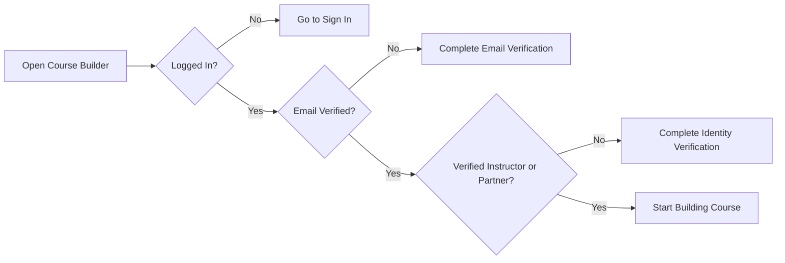

---

## 2) Create Draft Course (Core Info)

Endpoint:
- `POST create/`

Primary fields for creation/update (`NidusCourseCreateUpdateSerializer`):

| Field | Required | Notes |
|---|---|---|
| `title` | Yes | min 5 chars |
| `description` | Recommended | mandatory before submit |
| `thumbnail` | No | image upload |
| `price` | No | decimal, min 0 |
| `language` | No | default: `English` |
| `level` | No | `beginner\|intermediate\|advanced` |
| `duration_minutes` | No | integer |
| `category` | No | active category id |

**Not writable on course create/update:**
- `instructors` — auto-assigned from the creator at creation. Co-instructors are added via the invitation workflow (see Section 13), not via this serializer.
- `partner_institutions` — assigned automatically based on the creator's partner profile context; not a writable list field.
- `status` — managed exclusively via dedicated transition endpoints (submit, review, rework, archive, restore).
- `slug` — auto-generated from `title`; not writable.

**Inline metadata (writable on PATCH):**
- `learning_objectives` — list of `{text, display_order}` (also managed via granular endpoints)
- `prerequisites` — list of `{text, display_order}`
- `audiences` — list of `{text, display_order}`

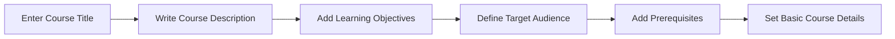

---

## 3) Edit and Autosave Course Metadata

Suggested UI sections:

- Basic Info: title, description, thumbnail, price, language, level, duration
- Taxonomy: category
- Team: instructors, partner institutions
- Outcomes: learning objectives
- Entry Bar: prerequisites
- Audience: audiences

Endpoints:
- `PATCH <course_id>/`
- Optional granular list/create/update/delete endpoints:
  - `<course_id>/learning-objectives/`, `learning-objectives/<item_id>/`
  - `<course_id>/prerequisites/`, `prerequisites/<item_id>/`
  - `<course_id>/audiences/`, `audiences/<item_id>/`

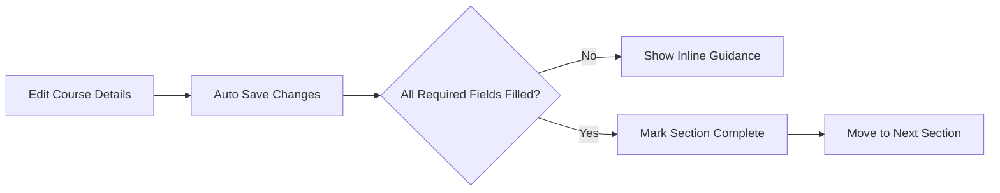

---

## 4) Build Curriculum Sections

Endpoints:
- `POST <course_id>/sections/create/`
- `GET <course_id>/sections/`
- `GET/PATCH/PUT/DELETE sections/<section_id>/`

Section fields:
- `title` (required, min 2 chars)
- `description` (optional)
- `position` (required; must be a positive integer; unique per course)

The detail view supports both PATCH (partial update) and PUT (full replace). Response includes read-only `course_id` and `course_title` fields.

Builder behavior recommendation:
- keep sections ordered
- use explicit drag/drop reorder logic by updating positions

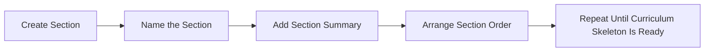

---

## 5) Add Content Items Through Unified Curriculum Endpoint

Primary endpoint (recommended):
- `POST sections/<section_id>/contents/`

This creates both:
- concrete content object (Lecture/Quiz/Assignment/CodingExercise)
- `SectionContent` row for ordering

`item_type` options (field name is `item_type`, not `content_type`):
- `lecture`
- `quiz`
- `assignment`
- `coding`

`SectionContent` is the single source of truth for order inside a section.

**Position assignment:** `position` is optional in the POST body. If omitted, the backend assigns the next available position (appends to end). If provided, it must be a positive integer; the backend shifts existing items to maintain unique positions.

**Response:** Returns a `SectionContent` wrapper object containing the created item's summary (`content_type`, `object_id`, `item_type`, `position`) plus a `content` block with the created object's fields.

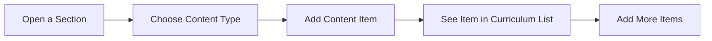

---

## 6) Lecture Authoring Flow

Endpoints:
- `GET sections/<section_id>/lectures/`
- `PATCH lectures/<lecture_id>/`
- `DELETE lectures/<lecture_id>/`

Create/update fields (`LectureCreateUpdateSerializer`):

| Field | Required | Notes |
|---|---|---|
| `title` | Yes | min 2 chars |
| `lecture_type` | Yes | `video\|article` |
| `is_preview` | No | bool, default `false` |
| `article_content` | Conditional | required when `lecture_type=article` |
| `video_file` | Conditional | required on create when `lecture_type=video` |

Validation rules:
- Article lecture cannot include `video_file`.
- Video lecture cannot include `article_content`.
- Video replacement triggers a new processing job; the old `VideoAsset` is deactivated (`is_active=False`) and a new one is created with `status=uploading`.
- Unknown fields in the payload are rejected with a validation error (strict field checking).
- GET response includes read-only `section_id` and `active_video_asset` block (with `status`, `stream_master_playlist`, renditions).

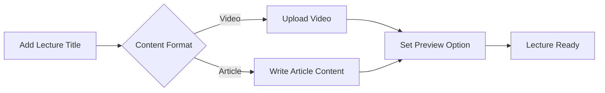

---

## 7) Quiz Authoring Flow

Endpoints:
- `PATCH quizzes/<quiz_id>/`
- `GET/POST quizzes/<quiz_id>/questions/`
- `PATCH/DELETE quiz-questions/<question_id>/`
- `GET/POST quiz-questions/<question_id>/answers/`
- `PATCH/DELETE quiz-answers/<answer_id>/`

Quiz fields:

| Field | Required | Notes |
|---|---|---|
| `title` | Yes | min 2 chars |
| `description` | No | optional text |
| `related_lectures` | No | list of lecture IDs (M2M association — marks which lectures this quiz covers; not used for access control) |

GET response includes read-only `section_id` and `question_count`.

Question fields:

| Field | Required | Notes |
|---|---|---|
| `question_text` | Yes | — |
| `position` | No | auto-assigned if omitted; integer; caller-supplied value is accepted and shifts existing items |

Answer fields:

| Field | Required | Notes |
|---|---|---|
| `answer_text` | Yes | — |
| `is_correct` | Yes | boolean |

Constraints:
- Only one correct answer per question. Creating a second `is_correct=true` answer for the same question returns a 400 validation error.
- GET response includes read-only `question_id` on each answer.

Quiz format for frontend:
- Quizzes are MCQ-based.
- Each question has multiple options; exactly one is `is_correct=true`.
- Learner view: `is_correct` is stripped entirely — never expose it from instructor serializers to learner-facing endpoints.

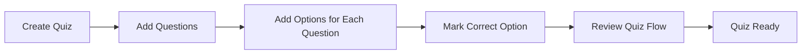

---

## 8) Assignment Authoring Flow

Endpoints:
- `GET/POST sections/<section_id>/assignments/`
- `PATCH/DELETE assignments/<assignment_id>/`
- `GET/POST assignments/<assignment_id>/questions/`
- `PATCH/DELETE assignment-questions/<question_id>/`
- `PATCH assignments/<assignment_id>/questions/reorder/`

Assignment fields:

| Field | Required | Notes |
|---|---|---|
| `title` | Yes | min 2 chars |
| `description` | No | — |
| `instructions` | No | — |
| `passing_score` | No | decimal; must be ≤ `total_score` (sum of all question `points`) if provided |

`total_score` is read-only on the response — it is the sum of `AssignmentQuestion.points` across all questions and is recomputed on every question change. `passing_score` is the instructor-declared threshold.

Assignment question fields:

| Field | Required | Notes |
|---|---|---|
| `question_text` | Yes | — |
| `points` | No | integer, default 0 |
| `hint` | No | optional hint shown to learner |
| `model_answer` | No | instructor-only; never shown to learners pre-submit; revealed post-grading |
| `rubric` | No | JSON list of criterion objects (see Rubric Schema below) |
| `position` | No | auto-assigned on create; reorder via dedicated endpoint |

**Rubric Schema:**

`rubric` is a JSON array of criterion objects used by the auto-grader. Each criterion:

```json
{
  "type": "keyword|regex|min_length|max_length|any_of|all_of",
  "value": "<criterion-specific value>",
  "points": 5
}
```

| Criterion type | `value` | Effect |
|---|---|---|
| `keyword` | string | Passes if answer contains the keyword (case-insensitive) |
| `regex` | regex string | Passes if answer matches the pattern |
| `min_length` | integer | Passes if answer has ≥ N characters |
| `max_length` | integer | Passes if answer has ≤ N characters |
| `any_of` | list of strings | Passes if answer contains any of the strings |
| `all_of` | list of strings | Passes if answer contains all of the strings |

Sum of `criterion.points` across the rubric should equal the question's `points` value — the grader awards partial credit per criterion.

**Reorder endpoint:** `PATCH assignments/<assignment_id>/questions/reorder/`

Body: `{"ordered_ids": [3, 1, 2]}` — list of question IDs in desired order. Backend assigns positions 1, 2, 3... to match the supplied order. Returns the reordered question list.

---

### Assignment Type A — Essay (Single Long-form Question)

Use this when you want the learner to write one detailed response — an explanation, a report, a reflection, or a design proposal.

**How it works:** One question, one big text box for the learner, auto-graded by keyword/length rules.

**Example — "Create the Assignment" step:**

```json
POST /api/v1/courses/sections/<section_id>/contents/
{
  "item_type": "assignment",
  "title": "How the Internet Works",
  "instructions": "Read the lesson material and answer the question below in your own words. Aim for at least 150 words.",
  "passing_score": 6
}
```

**Example — "Add the Question" step:**

```json
POST /api/v1/courses/assignments/<assignment_id>/questions/
{
  "question_text": "Explain in your own words how a web browser gets a webpage from the internet. Include what happens from the moment you type a URL to when the page appears on screen.",
  "hint": "Think about DNS, the server, and how data travels back to your browser.",
  "model_answer": "When you type a URL, the browser first asks a DNS server to find the IP address of the website. It then sends an HTTP request to that server. The server responds with the webpage files (HTML, CSS, images). The browser reads those files and displays the page on screen.",
  "points": 10,
  "rubric": [
    { "type": "keyword",    "value": "DNS",      "points": 2 },
    { "type": "keyword",    "value": "server",   "points": 2 },
    { "type": "any_of",    "value": ["HTTP", "request"], "points": 2 },
    { "type": "keyword",    "value": "browser",  "points": 2 },
    { "type": "min_length", "value": 150,        "points": 2 }
  ]
}
```

**What the grader checks:**
- Does the answer mention "DNS"? → 2 points
- Does it mention "server"? → 2 points
- Does it mention "HTTP" or "request"? → 2 points
- Does it mention "browser"? → 2 points
- Is the answer at least 150 characters long? → 2 points

Learner passes with ≥ 6 out of 10 (`passing_score`). The `model_answer` is hidden until grading is done, then shown to the learner so they can learn from it.

---

### Assignment Type B — Multi-Question (Several Focused Questions)

Use this when you want to test specific knowledge across several smaller questions — like a structured worksheet or a practical task broken into steps.

**How it works:** Multiple questions, each graded independently, total score is the sum of all question points.

**Example — "Create the Assignment" step:**

```json
POST /api/v1/courses/sections/<section_id>/contents/
{
  "item_type": "assignment",
  "title": "Web Development Basics Check",
  "instructions": "Answer all three questions. Each question is graded separately. Take your time and be specific.",
  "passing_score": 12
}
```

**Example — "Add Question 1" (definition question):**

```json
POST /api/v1/courses/assignments/<assignment_id>/questions/
{
  "question_text": "What is HTML and what is it used for?",
  "hint": "Think about what HTML stands for and what you see in a web browser.",
  "model_answer": "HTML stands for HyperText Markup Language. It is the standard language used to create and structure content on the web, such as headings, paragraphs, links, and images.",
  "points": 5,
  "rubric": [
    { "type": "any_of",    "value": ["HyperText Markup Language", "markup language"], "points": 2 },
    { "type": "any_of",    "value": ["structure", "content", "web page"],             "points": 2 },
    { "type": "min_length", "value": 50,                                              "points": 1 }
  ]
}
```

**Example — "Add Question 2" (comparison question):**

```json
POST /api/v1/courses/assignments/<assignment_id>/questions/
{
  "question_text": "What is the difference between a frontend and a backend in a web application? Give one example of each.",
  "hint": "Frontend is what users see; backend is what runs on the server.",
  "model_answer": "The frontend is the part of a web app the user interacts with directly — for example, a login form built with HTML and JavaScript. The backend is the server-side logic that processes requests and stores data — for example, a Python server that checks passwords and returns a token.",
  "points": 8,
  "rubric": [
    { "type": "any_of",    "value": ["frontend", "front end", "front-end"], "points": 2 },
    { "type": "any_of",    "value": ["backend",  "back end",  "back-end"],  "points": 2 },
    { "type": "keyword",   "value": "server",                               "points": 2 },
    { "type": "min_length", "value": 80,                                    "points": 2 }
  ]
}
```

**Example — "Add Question 3" (practical question):**

```json
POST /api/v1/courses/assignments/<assignment_id>/questions/
{
  "question_text": "List three things you should check before making a website live for the public.",
  "hint": "Consider security, performance, and usability.",
  "model_answer": "Before going live, you should check: (1) that all links work and there are no broken pages, (2) that the site loads quickly on mobile devices, and (3) that user data is sent securely using HTTPS.",
  "points": 6,
  "rubric": [
    { "type": "any_of",    "value": ["HTTPS", "secure", "security"],   "points": 2 },
    { "type": "any_of",    "value": ["mobile", "responsive", "speed", "performance"], "points": 2 },
    { "type": "any_of",    "value": ["link", "broken", "test", "check"], "points": 2 }
  ]
}
```

**Score summary for this assignment:**

| Question | Max points |
|---|---|
| Q1 — What is HTML | 5 |
| Q2 — Frontend vs Backend | 8 |
| Q3 — Pre-launch checklist | 6 |
| **Total** | **19** |
| Passing score | 12 (≈ 63%) |

**Reorder the questions** (put the easiest first):

```json
PATCH /api/v1/courses/assignments/<assignment_id>/questions/reorder/
{
  "ordered_ids": [<q1_id>, <q3_id>, <q2_id>]
}
```

---

Assignment types (recommended frontend patterns):
- Essay assignment (single long-form response):
  - Use one question item with a detailed essay prompt in `question_text`.
  - Use `model_answer` for a sample response the learner sees after grading.
  - Keep total marks in that question's `points`.
- Multi-question assignment (several structured questions):
  - Add multiple question items, each with its own `points` and optional `hint`.
  - Reorder questions to control the flow (easiest first, hardest last).
  - `passing_score` applies to the combined total.

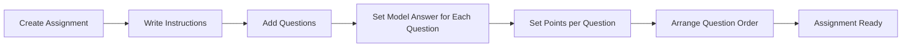

---

## 9) Coding Exercise Authoring Flow

Endpoints:
- `PATCH/DELETE coding-exercises/<exercise_id>/`
- `GET/POST coding-exercises/<exercise_id>/language-configs/`
- `PATCH/DELETE coding-exercises/<exercise_id>/language-configs/<config_id>/`
- `GET/POST coding-exercises/<exercise_id>/testcases/`
- `PATCH/DELETE coding-exercises/<exercise_id>/testcases/<tc_id>/`

Coding exercise fields:

| Field | Required | Notes |
|---|---|---|
| `title` | Yes | min 3 chars |
| `problem_statement` | Yes | — |
| `supported_languages` | Yes | non-empty list; valid values: `python`, `javascript`, `cpp`, `java` |
| `default_language` | No | must be in `supported_languages` |
| `description` | No | — |
| `difficulty` | No | `easy\|medium\|hard` |
| `time_limit_ms` | No | integer milliseconds |

Language config fields:

| Field | Required | Notes |
|---|---|---|
| `language` | Yes | one of the 4 supported languages |
| `starter_code` | No | skeleton code shown to learner |
| `solution_code` | No | instructor-only; never exposed to learners |

Test case fields:

| Field | Required | Notes |
|---|---|---|
| `input_data` | Yes | string passed to learner's `solve()` function |
| `expected_output` | Yes | string the harness compares against stdout |
| `is_hidden` | No | bool, default `false`; hidden cases omitted from learner view, included in grading |
| `explanation` | No | optional hint shown after grading |
| `position` | No | auto-assigned if omitted; shifts neighbors on delete to keep positions contiguous |

**Side effect on test case delete:** when a test case is deleted, the backend decrements positions of all test cases with higher position values to maintain a contiguous 1, 2, 3... sequence.

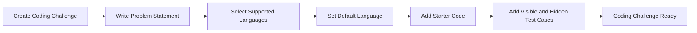

---

## 10) Reorder Curriculum Items

Endpoint:
- `PATCH contents/<content_id>/reorder/`

Purpose:
- move any mixed item type (`lecture/quiz/assignment/coding`) within section order
- backend shifts neighbor items atomically and keeps unique positions

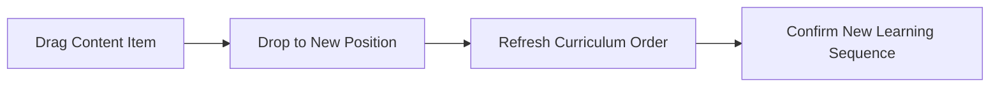

---

## 11) Submission Readiness Checks (Critical)

Endpoint:
- `POST <course_id>/submit/`

Course can move `draft -> under_review` only if all checks pass:

- non-empty `title`
- non-empty `description`
- at least one section
- every section has at least one content item
- all active video assets are `ready`
- each quiz has at least one question
- each quiz question has at least one correct answer

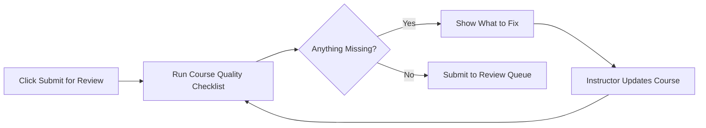

---

## 12) Admin Review, Publish, Reject, Rework, Archive, Restore

Status machine:
- `draft → under_review` (instructor via submit)
- `under_review → published | rejected` (admin via review)
- `rejected → draft` (instructor via rework)
- `published → archived` (instructor or admin via archive)
- `archived → draft` (instructor or admin via restore)

Endpoints and callers:

| Endpoint | Who | Payload | Transition |
|---|---|---|---|
| `POST <id>/submit/` | Verified course creator | *(empty)* | `draft → under_review` |
| `POST <id>/review/` | Admin | `{"action": "approve"}` or `{"action": "reject", "rejection_reason": "..."}` | `under_review → published\|rejected` |
| `POST <id>/rework/` | Verified course creator (on course) | *(empty)* | `rejected → draft` |
| `POST <id>/archive/` | Verified course creator or admin | *(empty)* | `published → archived` |
| `POST <id>/restore/` | Verified course creator or admin | *(empty)* | `archived → draft` |

All transition endpoints return the updated course object on `200 OK`. Invalid transitions return `422`.

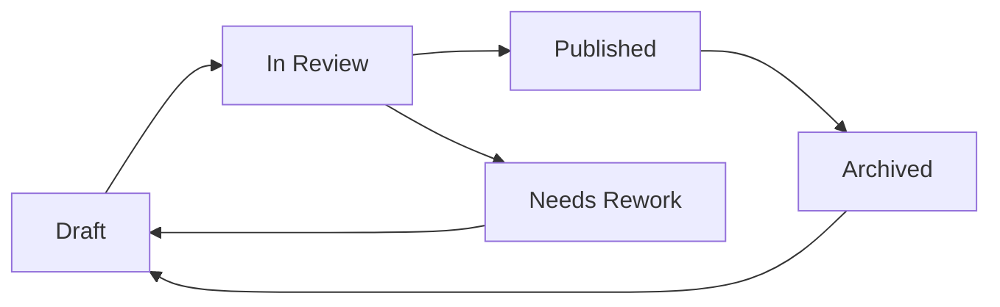

---

## 13) Co-instructor Invitation Workflow

Course owners (the creator — instructor or partner institution) can invite other verified instructors to co-author a course. Co-instructors can edit content but cannot manage the instructor roster or change course ownership.

**Invitation status lifecycle:** `pending → accepted | declined | revoked | expired`

### 13.1 Send an Invite

**POST** `<course_id>/instructors/invite/`

Payload: `{"email": "co.instructor@example.com"}`

- Caller must be the course **owner** (`created_by`). Co-instructors cannot send invites.
- Target must be a verified instructor already on the platform.
- Only one pending invite per `(course, user)` pair — creating a duplicate returns 400.
- Course must be in an editable state (`draft` or `rejected`); inviting on a published/archived course returns 422.
- Invitee receives an email with a token-based link.

### 13.2 List Invites for a Course

**GET** `<course_id>/instructors/invites/`

Owner only. Optional filter: `?status=pending|accepted|declined|expired|revoked`

### 13.3 Revoke an Invite

**DELETE** `<course_id>/instructors/invites/<invite_id>/`

Owner only. Only `pending` invites can be revoked. Returns 422 for any other status.

### 13.4 Invitee: List My Received Invites

**GET** `invites/my/`

Invitee's own invite inbox. Defaults to `?status=pending`. Pass `?status=accepted|declined|expired|revoked` for history.

### 13.5 Accept an Invite

**POST** `invites/<token>/accept/`

Invitee only (token is bound to the invited user). On success the invitee is atomically added to `course.instructors`. Returns 410 if the invite is no longer valid (expired, revoked, already responded).

### 13.6 Decline an Invite

**POST** `invites/<token>/decline/`

Invitee only. The record is kept (visible to owner via the list endpoint). Owner can send a new invite to the same user after a decline.

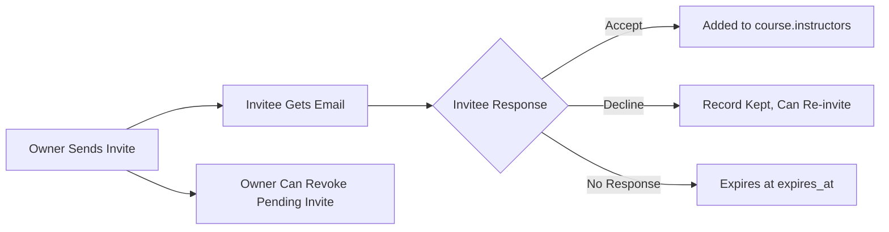

---

## 14) Recommended Builder UI Stepper (Practical Product Flow)

Suggested wizard sequence:

1. Course Basics
2. Outcomes & Audience
3. Pricing & Publishing Metadata
4. Sections
5. Curriculum Items
6. Type-Specific Authoring (Lecture/Quiz/Assignment/Coding)
7. Reorder & QA
8. Submit for Review

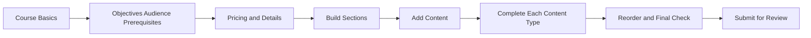

---

## 15) Field Checklist by Content Type (Quick Reference)

### Course
- `title`, `description`, `thumbnail`, `price`, `language`, `level`, `duration_minutes`, `category`
- arrays: `learning_objectives[]`, `prerequisites[]`, `audiences[]`
- **Note:** `instructors` and `partner_institutions` are NOT writable — auto-assigned at creation; co-instructors added via invitation (Section 13)

### Section
- `title`, `description`, `position`

### Lecture
- `title`, `lecture_type`, `is_preview`, (`article_content` OR `video_file`)

### Quiz
- quiz: `title`, `description`, `related_lectures` (optional list of lecture IDs)
- question: `question_text`, `position` (auto-assigned if omitted)
- answer: `answer_text`, `is_correct` (exactly one correct per question)

### Assignment
- assignment: `title`, `description`, `instructions`, `passing_score` (must be ≤ `total_score`)
- question: `question_text`, `model_answer`, `rubric` (JSON criterion list), `points`, `hint`, `position`
- reorder: `PATCH assignments/<id>/questions/reorder/` body `{"ordered_ids": [...]}`

### Coding Exercise
- exercise: `title`, `problem_statement`, `supported_languages` (list from `python|javascript|cpp|java`), `default_language`, `description`, `difficulty`, `time_limit_ms`
- language config: `language`, `starter_code`, `solution_code` (instructor-only)
- testcase: `input_data`, `expected_output`, `is_hidden`, `explanation`, `position`

---

## 16) Error Handling Contract for Builder

Design UI error handling to support:

- field-level validation errors from serializers
- lifecycle errors from transition guards
- completeness errors on submit as a dictionary keyed by area

Best UX behavior:
- keep user on same step
- highlight invalid fields/sections directly
- maintain unsaved editor buffers where possible

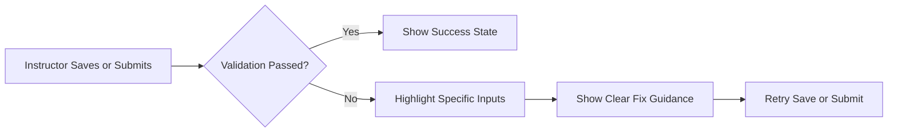

---

## 17) Implementation Notes from Current Backend Design

- Ordering is centralized in `SectionContent`; content models do not own curriculum position.
- Deleting a lecture/quiz/assignment/coding item cascades and removes its `SectionContent` row automatically (via `GenericRelation`).
- Video processing is asynchronous and blocks submission until all active assets are `ready`. Poll `GET lectures/<id>/` and check `active_video_asset.status`.
- Course editability is tied to status: `draft` and `rejected` are editable; `under_review`, `published`, and `archived` are read-only. Attempting an edit on a non-editable course returns 422.
- `instructors` list is managed via co-instructor invitations (Section 13), not via PATCH on the course. The course creator is always in `instructors`.
- `total_score` on an assignment is computed (sum of all question `points`) — do not try to set it directly; it updates automatically when questions are added or modified.
- `passing_score` must be ≤ `total_score` at submit time; the backend validates this cross-field constraint.
- Test case positions on coding exercises auto-decrement when a test case is deleted, keeping a contiguous 1, 2, 3... sequence. Do not cache position values client-side.
- `solution_code` on language configs and `model_answer`/`rubric` on assignment questions are instructor-only and must never appear in learner-facing serializers.
- Rubric criterion `points` are consumed by the auto-grader (`RubricGrader`) at grading time. Adding a new criterion type requires changes in `assignment_grading.py` (`_MATCHERS`) and the authoring serializer (`_RUBRIC_CRITERION_VALUE_VALIDATORS`).

The builder should treat:
- curriculum ordering as one shared drag-and-drop layer (all types via `SectionContent`),
- content-type editors as modular sub-forms loaded on demand,
- submission as a strict server-side validation gate (do not replicate completeness checks client-side; use the 400 error payload to highlight missing fields).
