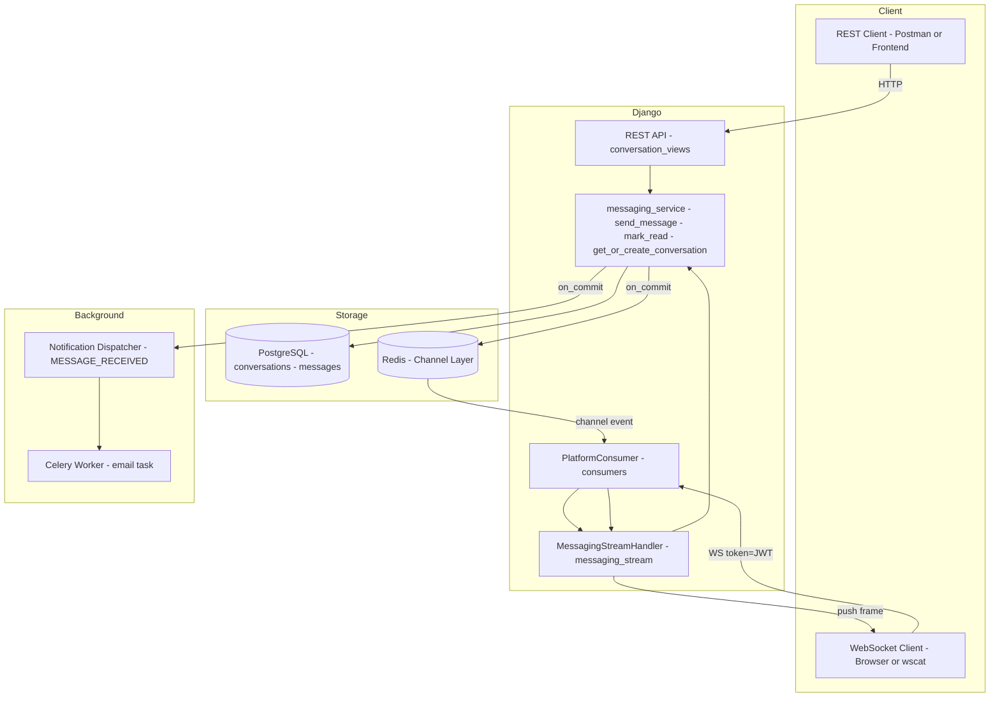
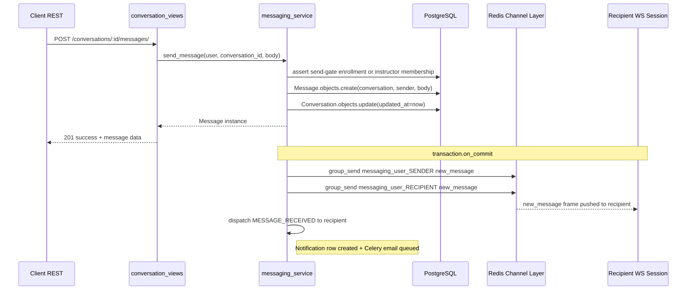
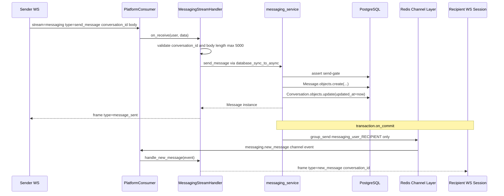
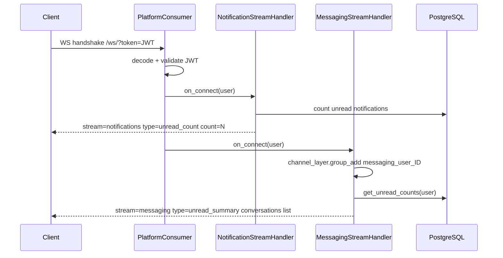

# 16 — Messaging System

Direct messaging between learners and the instructors of their enrolled courses.

---

## Scope

Phase 1 covers learner ↔ instructor messaging only. Partner institutions, admins, and learner-to-learner messaging are out of scope.

---

## Business Rules

| Rule | Detail |
|---|---|
| Who initiates | Learner only. Instructors can reply but cannot open new threads. |
| Enrollment gate (send) | Learner must have `Enrollment(is_active=True)` for the course at send time. |
| Instructor gate (send) | Instructor must still be in `course.instructors.all()` at send time. |
| Read access | Either party can read historical messages even after unenrollment or instructor removal. |
| Scope | One conversation per `(learner, instructor, course)` triad. Multi-instructor courses → separate thread per instructor. |
| Message length | Max 5000 characters, enforced in serializer + WS handler. |

---

## Data Model

### `Conversation`

Table: `conversations`

| Column | Type | Notes |
|---|---|---|
| `id` | BigInt PK | |
| `learner_id` | FK → User | |
| `instructor_id` | FK → User | |
| `course_id` | FK → NidusCourse CASCADE | |
| `learner_last_read_at` | DateTimeField null | Unread state for learner |
| `instructor_last_read_at` | DateTimeField null | Unread state for instructor |
| `created_at` | auto | |
| `updated_at` | auto, indexed | Used for inbox ordering |

Constraints:
- `UNIQUE(learner, instructor, course)` — one thread per triad
- `CHECK(learner != instructor)` — sanity guard

Indexes: `(learner, -updated_at)`, `(instructor, -updated_at)`

### `Message`

Table: `messages`

| Column | Type | Notes |
|---|---|---|
| `id` | BigInt PK | |
| `conversation_id` | FK → Conversation CASCADE | |
| `sender_id` | FK → User CASCADE | |
| `body` | TextField | |
| `is_deleted` | Boolean default False | Soft-delete; hidden from clients, kept for audit |
| `created_at` | auto, indexed | |

Index: `(conversation, created_at)`

### Unread count pattern

Unread = messages where `created_at > caller_last_read_at`.  
Marking read = one `UPDATE conversations SET *_last_read_at = NOW()`.  
This avoids per-message `is_read` flags and the N UPDATE rows they'd require.

---

## Architecture

### Component Overview



---

### REST Send Flow

Client sends via `POST /conversations/<id>/messages/`. WS push to both parties fires after the DB transaction commits.



---

### WebSocket Send Flow

Client sends via WS stream. `message_sent` is an immediate ack delivered only to the sender's session. `new_message` is pushed only to the recipient's channel group — the sender's group is excluded to prevent duplicate delivery.



---

### WebSocket Connect Flow

On connect, both the notification stream and the messaging stream push their respective unread summaries immediately.



---

## REST API

Base path: `/api/v1/messaging/`

All endpoints require `IsAuthenticated + IsEmailVerified + (IsLearnerUser OR IsInstructorUser)`.

| Method | URL | Who | Notes |
|---|---|---|---|
| `GET` | `conversations/` | Both | Paginated list, `?page_size=N` supported |
| `POST` | `conversations/create/` | Learner only | Creates conversation + first message atomically |
| `GET` | `conversations/<id>/` | Participant | Metadata + paginated messages |
| `POST` | `conversations/<id>/messages/` | Participant | Send-gate checked in service |
| `POST` | `conversations/<id>/read/` | Participant | Updates `*_last_read_at` |

Access-denied policy: numeric IDs → 404 (project-wide rule).

### `POST conversations/create/` body

```json
{
  "course_id": 42,
  "instructor_id": 7,
  "body": "Hello, I have a question about lecture 3."
}
```

Returns 201 on creation, 200 if conversation already exists (idempotent).

---

## WebSocket

Stream name: `messaging` (multiplexed via the existing `PlatformConsumer` at `/ws/`).

### Client → Server

```json
{ "stream": "messaging", "payload": { "type": "send_message", "conversation_id": 5, "body": "..." } }
{ "stream": "messaging", "payload": { "type": "mark_read", "conversation_id": 5 } }
```

### Server → Client

```json
{ "stream": "messaging", "payload": { "type": "new_message",   "conversation_id": 5, "message": {...} } }
{ "stream": "messaging", "payload": { "type": "message_sent",  "message": {...} } }
{ "stream": "messaging", "payload": { "type": "marked_read",   "conversation_id": 5 } }
{ "stream": "messaging", "payload": { "type": "unread_summary","conversations": [{"conversation_id": 5, "unread_count": 2}] } }
{ "stream": "messaging", "payload": { "type": "error",         "detail": "..." } }
```

On connect: each user joins the channel group `messaging_user_{user_id}`. `unread_summary` is pushed immediately with per-conversation unread counts.

On new message (REST or WS): the service pushes a `messaging.new_message` channel event only to `messaging_user_{recipient_id}`. The sender already has the message — via `message_sent` (WS path) or the 201 response body (REST path) — so pushing to the sender group would cause duplicate delivery on the WS path. The `PlatformConsumer.messaging_new_message` handler routes the channel event to `MessagingStreamHandler.handle_new_message`.

Send-gate is enforced inside `messaging_service.send_message` — the same function is called from both REST and WS paths so rules are never duplicated.

---

## Notifications

New event type: `message.received` (`NotificationEventType.MESSAGE_RECEIVED`)  
New category: `messaging` (`NotificationCategory.MESSAGING`)

When a message is sent, the service calls `notifications.services.dispatcher.dispatch(MESSAGE_RECEIVED, [recipient], context)` inside a `transaction.on_commit` callback. The existing email preference system (`MESSAGING` category) controls whether the recipient also gets an email.

---

## Files

### New

| File | Purpose |
|---|---|
| `messaging/models.py` | `Conversation`, `Message` |
| `messaging/migrations/0001_initial.py` | DB tables |
| `messaging/services/messaging_service.py` | All business logic |
| `messaging/serializers.py` | `ConversationSerializer`, `MessageSerializer`, input serializers |
| `messaging/all_views/conversation_views.py` | 5 APIView subclasses |
| `messaging/views.py` | Re-export |
| `messaging/urls.py` | URL patterns |
| `messaging/tests/test_models.py` | Model constraint tests |
| `messaging/tests/test_services.py` | Service layer tests |
| `messaging/tests/test_views.py` | REST endpoint tests |

### Modified

| File | Change |
|---|---|
| `career_college_backend/settings.py` | Added `messaging.apps.MessagingConfig` to `INSTALLED_APPS` |
| `career_college_backend/urls.py` | Added `/api/v1/messaging/` route |
| `notifications/models.py` | Added `MESSAGE_RECEIVED` event type + `MESSAGING` category |
| `notifications/services/builders.py` | Added `_message_received` builder |
| `notifications/services/preference_service.py` | Added `MESSAGE_RECEIVED → MESSAGING` mapping |
| `core/permissions.py` | Added `IsConversationParticipant` |
| `realtime/streams/messaging_stream.py` | Full implementation (was a stub) |
| `realtime/consumers.py` | Added `messaging.new_message` dispatch entry + `messaging_new_message` handler |

---

## Security Notes

- Numeric IDs → 404 on no-access (consistent with project-wide policy).
- Send-gate is re-checked on every send — enrollment status can change between conversation creation and message send.
- WS and REST paths call the same service function; the gate cannot be bypassed by switching channels.
- `get_conversation_for_participant` uses an OR filter on the same DB call — no separate participant check that could be skipped.
- Message bodies are stored and returned as plain text. No HTML rendering server-side.
