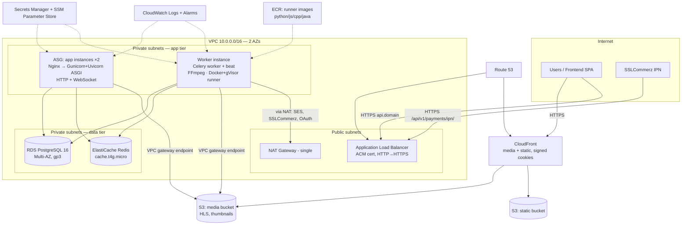

# AWS Deployment Architecture — Career College Backend

**Status:** Proposal (v1)
**Date:** 2026-07-18
**Scope:** Production deployment of the Django/DRF backend on AWS for ~10,000 courses, moderate traffic, high availability preferred, cost-conscious.

**Region assumption:** `ap-south-1` (Mumbai). Payments run on SSLCommerz in BDT, so the user base is Bangladesh-centric; Mumbai is the closest full-featured AWS region (~40–60 ms from Dhaka). All prices below are approximate on-demand USD/month for ap-south-1 unless noted, and should be re-verified against the AWS pricing calculator before committing.

---

## 1. Current Architecture Analysis

### 1.1 Project structure

Single Django project (`career_college_backend`) with 10 apps plus a shared `core` package:

| App | Responsibility | Deployment-relevant traits |
|---|---|---|
| `authentication` | Email-based custom user, OTP, JWT (SimpleJWT), Google/LinkedIn OAuth, partner-institution console | Celery email tasks; `pg_trgm` GIN indexes |
| `courses` | Course authoring, curriculum, lectures, quizzes, assignments, **video pipeline**, **coding exercises**, reviews, schedules, certificates | FFmpeg transcoding; Docker-based code runner; Celery beat tasks |
| `id_verification` | Instructor + institution verification state machines | Document uploads (accreditation files) |
| `messaging` | Learner↔instructor DM (REST + WebSocket) | Redis channel layer |
| `notifications` | In-app feed + email dispatch | Dedicated Celery queue `notifications` |
| `realtime` | ASGI `PlatformConsumer` at `/ws/` | Daphne/ASGI required; JWT via `?token=` |
| `webinars` | Institution webinars (external meeting links) | Thumbnail uploads |
| `analytics` | Read-only aggregation dashboards | Heavy aggregate queries (fixed count, well-designed) |
| `payments` | SSLCommerz hosted checkout, order lifecycle | Public IPN callback must be reachable; beat reaper task |
| `admin_console` | Session-based admin back-office | Django sessions in DB; CSRF on writes |

### 1.2 Runtime processes required

The application is **not** a single process. Production needs at minimum:

1. **HTTP API server** — WSGI (Gunicorn is in `requirements.txt`) for the REST API.
2. **WebSocket server** — ASGI (Daphne installed; `ASGI_APPLICATION` configured) for `/ws/`.
3. **Celery worker(s)** — default queue (transcoding, grading, code execution, payments reaper) + `notifications` queue (email).
4. **Celery beat** — 5 scheduled tasks: `reap_stuck_coding_submissions` (60 s), `expire_instructor_invites` (hourly), `purge_old_notifications` (daily), `reap_stale_processing_orders` (15 min), `advance_course_schedules` (5 min).
5. **Redis** — Celery broker/result backend **and** Channels channel layer (same URL today).
6. **PostgreSQL** — with `pg_trgm` extension (trigram GIN indexes on `User.email/full_name` and `NidusCourse`).
7. **Docker daemon + gVisor** — the coding-exercise runner (`courses/services/code_runner.py`) calls `docker.from_env()` and runs one container per submission with `runtime=runsc` in production (`RUNNER_RUNTIME_PROD`), ulimits, and per-language images (`RUNNER_IMAGE_PYTHON/JAVASCRIPT/CPP/JAVA`).
8. **FFmpeg/FFprobe binaries** — video transcoding (`courses/transcoding.py`) produces 5 HLS renditions (240p–1080p).

### 1.3 Database usage

- PostgreSQL via `psycopg2-binary`; engine/credentials from env (`DB_*`).
- `django.contrib.postgres` in `INSTALLED_APPS`; `pg_trgm` extension required; partial unique indexes used extensively (enrollments, orders, assignment submissions) — **PostgreSQL is non-negotiable**, no Aurora-Serverless-v1-style compatibility concerns (all features are standard PG).
- Sessions stored in DB (`django_session`) for the admin console.
- No connection pooling configured (`CONN_MAX_AGE` unset → new connection per request).

### 1.4 Authentication

- SimpleJWT: 12 h access / 7 d refresh, rotation + blacklist (`token_blacklist` app → DB tables grow; blacklist rows accumulate).
- Tokens accepted from `Authorization: Bearer` header **or** HttpOnly `access_token` cookie (`CookieJWTAuthentication`).
- Google + LinkedIn OAuth authorization-code flows (server-side callback URLs must match the production domain).
- Admin console: Django **session** auth + CSRF, sliding 30 min idle timeout, sessions in DB.
- WebSocket auth: JWT as `?token=` query param.

### 1.5 Static files

- `STATIC_URL = 'static/'` only. **No `STATIC_ROOT`, no WhiteNoise, no storage backend.** `collectstatic` will fail as configured. Static surface is small (DRF browsable API + Django admin), but it must be fixed for production.

### 1.6 Media files & upload flow

- Local filesystem storage: `MEDIA_ROOT` (default `./media`, currently ~200 MB in dev).
- Upload fields: `VideoAsset.video_file` (raw video, `FileField`), `NidusCourse.thumbnail`, `Webinar.thumbnail` (`ImageField`), `id_verification` accreditation/identity documents.
- **Video flow:** client uploads raw video through Django → `VideoAsset(status='uploading')` → Celery `transcode_video_asset_task` → FFmpeg writes HLS renditions to `media/courses/{slug}/lectures/{id}/hls/{asset_id}/` → status `ready`. Playback URLs point at `MEDIA_URL`.
- Certificates: generated on-the-fly with reportlab — **no file stored** (good; nothing to migrate).
- **This is the single biggest deployment constraint:** media on local disk means the web tier, the worker tier, and every future instance must share one filesystem. It blocks horizontal scaling until media moves to S3 (or EFS as a stopgap).

### 1.7 Scheduled tasks / background workers

Covered in 1.2 — Celery worker + beat are mandatory (video transcoding, assignment auto-grading, coding-exercise execution, payment reconciliation, schedule advancement, notification email). Views intentionally return 202/`task_id` and rely on the worker; **without a worker, emails silently never send** (documented behavior).

### 1.8 Third-party services

| Service | Purpose | Deployment requirement |
|---|---|---|
| SSLCommerz | Payments (hosted redirect + IPN) | `BACKEND_URL` publicly reachable over HTTPS for IPN; egress to `securepay.sslcommerz.com` |
| Google OAuth | Social login | Redirect URI registered for prod domain |
| LinkedIn OAuth | Social login | Same |
| SMTP (Gmail today) | Transactional email | Replace with SES in production (Gmail SMTP is rate-limited and unreliable for products) |

### 1.9 Environment variables & secrets

From `.env.example` + `settings.py`:

- **Secrets** (must live in a secret store, never in AMI/user-data/repo): `SECRET_KEY`, `DB_PASSWORD`, `EMAIL_HOST_PASSWORD`, `GOOGLE_CLIENT_SECRET`, `LINKEDIN_CLIENT_SECRET`, `SSLCOMMERZ_STORE_PASSWORD`.
- **Config** (Parameter Store): `ALLOWED_HOSTS`, `DEBUG`, `DB_*`, `EMAIL_*`, `CELERY_BROKER_URL`, `FRONTEND_URL` + callback paths, `JWT_COOKIE_*`, `BACKEND_URL`, `FFMPEG_BINARY_PATH`, `FFPROBE_BINARY_PATH`, `RUNNER_IMAGE_*`, `RUNNER_RUNTIME_PROD`, rate limits, `TIME_ZONE`.
- ⚠️ `TIME_ZONE = env('TIME_ZONE')` has **no default** — the app crashes at boot if unset. Same for `DB_ENGINE`/`DB_NAME`/`DB_USER`/`DB_PASSWORD`.

### 1.10 Potential deployment risks

| # | Risk | Severity |
|---|---|---|
| 1 | Media on local disk — blocks >1 instance, lost on instance replacement | **Critical** |
| 2 | Raw video uploads proxied through Django/ALB — multi-GB request bodies, worker/timeout pressure, ALB 100 s idle limits | **High** |
| 3 | Code runner needs Docker socket + gVisor → constrains compute choice (no Fargate for that component) and is a security-sensitive workload (untrusted code) | **High** |
| 4 | No `STATIC_ROOT` → `collectstatic` broken | High (trivial fix) |
| 5 | No production security settings: `SECURE_PROXY_SSL_HEADER`, `SECURE_SSL_REDIRECT`, HSTS | High |
| 6 | No health-check endpoint for ALB target groups | High (trivial fix) |
| 7 | Single Redis serves broker + channels + (future) cache — one failure domain | Medium |
| 8 | No `CONN_MAX_AGE` → connection churn against RDS | Medium |
| 9 | Gmail SMTP in production | Medium |
| 10 | File logging to local `logs/app.log` — lost on instance replacement, invisible fleet-wide | Medium |
| 11 | Transcoding and code execution share the default Celery queue with payment reconciliation — a burst of video uploads can starve the payments reaper | Medium |
| 12 | `pg_trgm` migrations use `CREATE INDEX CONCURRENTLY` — run migrations from one instance only, not in parallel during deploys | Low |

---

## 2. AWS Architecture Recommendation

### 2.1 Compute model decision: EC2, not Fargate/Beanstalk

| Option | Verdict | Why |
|---|---|---|
| **EC2 (ASG + ALB)** | ✅ **Recommended** | The coding-exercise runner requires a real Docker daemon with a custom runtime (`runsc`/gVisor) and the docker SDK socket. The transcoder wants scratch disk + FFmpeg. Both are natural on EC2. Simplest mental model for a small team; cheapest at this scale. |
| ECS on EC2 | ⭕ Later | Good evolution path (task placement, rolling deploys) once the team containerizes the app. Adds ECS learning curve now for little gain at 2–4 instances. |
| **ECS Fargate** | ❌ Not now | Fargate provides no Docker socket and no custom container runtimes — the code runner **cannot work** there. You'd have to split the runner onto EC2 anyway, running two compute paradigms. Fargate also has no GPU-less cheap burst tier for FFmpeg-scale CPU. Viable for the *web tier only* in the future. |
| Elastic Beanstalk | ❌ | Wraps exactly the EC2+ALB+ASG stack we're building, but hides it behind platform hooks that fight the multi-process reality (Daphne + Gunicorn + Celery + beat + Docker runner). Debugging EB platform hooks costs more than owning a launch template. |
| Lambda | ❌ | Long-running WebSockets, FFmpeg jobs measured in minutes, and Docker-in-Docker are all disqualifying. |

### 2.2 Target architecture



### 2.3 Service-by-service rationale

| Service | Use | Justification |
|---|---|---|
| **VPC** (2 AZs) | Network isolation | Standard. Two AZs is the HA floor; three adds cost without benefit at this scale. |
| **Public subnets** | ALB, NAT GW | Only the ALB terminates internet traffic. |
| **Private subnets** | App, worker, RDS, Redis | Instances have no public IPs; ingress only from ALB SG. |
| **Internet Gateway** | ALB ingress | Required. |
| **NAT Gateway** (single) | Egress for private instances (SES/SMTP, SSLCommerz validation API, OAuth token exchange, OS packages) | Required because the app makes outbound HTTPS calls. **One** NAT (not per-AZ) — saves ~$35/mo; an AZ outage taking down NAT is acceptable at this tier (documented trade-off; add a second when revenue justifies). Use a **free S3 gateway endpoint** so multi-GB video/S3 traffic never pays NAT processing fees. |
| **ALB** | HTTPS termination, HTTP→HTTPS redirect, WebSocket pass-through, health checks | ALB natively supports WebSockets (needed for `/ws/`). Path-based routing lets `/ws/*` target a separate port if you later split ASGI from WSGI. NLB unnecessary (no raw TCP need). |
| **EC2 ASG (app)** | Gunicorn+Uvicorn behind Nginx | See §3. ASG across 2 AZs, min 2 — that *is* the HA story for the web tier. |
| **EC2 (worker)** | Celery + beat + FFmpeg + Docker/gVisor runner | Isolates untrusted-code execution and CPU-heavy transcoding away from request latency. Single instance initially (beat must run exactly once); recovery via ASG min=max=1 ("self-healing singleton"). |
| **RDS PostgreSQL 16** | Primary datastore | Managed backups, Multi-AZ failover, `pg_trgm` supported. Self-managed PG on EC2 saves ~40% but costs far more in operational risk — not worth it. Aurora: 2–3× cost, benefits (fast clones, 15 replicas) irrelevant at this scale — revisit at ~100k users. |
| **ElastiCache Redis** | Celery broker + channel layer + Django cache | See §7. |
| **S3** (2 buckets) | Media (private) + static (public via CloudFront) | Durability, unlimited size, unblocks horizontal scaling. See §5. |
| **CloudFront** | CDN for HLS video, thumbnails, static | Video delivery from S3 direct would be slow (single region) and expensive per GB vs CloudFront; signed cookies gate paid content. |
| **Route 53** | DNS | Alias records to ALB/CloudFront; health-checked failover later. |
| **ACM** | TLS certs (free) | One cert for `api.domain` on ALB (regional), one for `cdn.domain` on CloudFront (**must be in us-east-1**). |
| **IAM** | Instance roles | No static AWS keys anywhere. See §8. |
| **SSM Parameter Store** | Non-secret config | Free (standard tier), integrates with instance role. |
| **Secrets Manager** | True secrets (6 listed in §1.9) | Rotation support for DB creds; ~$0.40/secret/mo is trivial. Alternative: SecureString parameters (free) — acceptable to cut $3/mo, but Secrets Manager's RDS-native rotation wins. |
| **CloudWatch** | Logs, metrics, alarms, dashboard | See §9. |
| **SSM Session Manager** | Shell access | No SSH keys, no bastion, no port 22 open. Audited sessions. |
| **ECR** | Code-runner images (python/js/cpp/java) | The runner pulls per-language images; ECR keeps them close, private, and scanned. Also home for the app image when you later containerize. |
| **AWS Backup** | Centralized RDS snapshot + (optional) EBS policies | One place for retention rules and restore testing. |
| **SES** | Replace Gmail SMTP | $0.10/1k emails, high deliverability, drop-in via Django SMTP settings against SES SMTP endpoint. |

**Not recommended (and why):** ~~EKS~~ (Kubernetes overhead absurd at 3 instances) · ~~EFS for media~~ (works as a stopgap for shared `MEDIA_ROOT`, but ~3× S3 cost/GB, no CDN story, throughput limits vs 10k-course video library — go straight to S3) · ~~SQS as Celery broker~~ (Celery's SQS transport doesn't support the result backend you use for coding-task polling (`AsyncResult`), and Channels needs Redis anyway — you'd run Redis regardless) · ~~ElastiCache Serverless~~ (min ~$90/mo; a t4g.micro node is $11) · ~~Global Accelerator, App Mesh, X-Ray~~ (see §9) · ~~AWS MediaConvert~~ for now (your FFmpeg pipeline works and is 5–10× cheaper per minute; revisit if transcoding operations become a burden).

---

## 3. EC2 Instance Recommendations

**Architecture choice: Graviton (arm64, t4g/c7g/m7g) wherever possible** — 20–40% better price/performance. Everything in the stack is arm64-clean: Python, psycopg2-binary, FFmpeg (excellent NEON support), Docker + gVisor (arm64 releases exist), Pillow, reportlab. **One caveat:** the four `RUNNER_IMAGE_*` code-runner images must be built/pulled as arm64. If that's friction, run only the worker on x86 (c7i/t3) and keep the web tier on Graviton.

| Role | Instance | vCPU / RAM | Expected utilization | ~$/mo (ap-south-1, on-demand) |
|---|---|---|---|---|
| **App server ×2** (Nginx + Gunicorn/Uvicorn ASGI) | **t4g.medium** | 2 / 4 GB | 15–35% CPU steady; burst credits absorb spikes. 4 GB fits ~5–6 Gunicorn workers + Nginx. | ~$19 each (~$38) |
| **Worker** (Celery default+notifications queues, beat, FFmpeg, Docker runner) | **c7g.large** | 2 / 4 GB | Bursty 0–100%: FFmpeg pegs cores per job; code runs are short. Compute-optimized because transcoding is pure CPU; t-family burst credits would exhaust on a batch of uploads. | ~$58 |
| Redis | — (ElastiCache, §7) | — | — | ~$11 |
| Beat | Runs on the worker instance (no separate box) | — | — | $0 |

**Sizing logic:**

- *App tier:* moderate traffic + 12 h JWTs (no per-request auth DB storm) + mostly simple CRUD → 2 vCPU boxes are plenty. Two instances in different AZs is the availability floor; scale out, not up. **t4g** over m7g because the workload is bursty API traffic, and t4g is ~⅓ the price of m7g.large — with `unlimited` burst mode as the safety valve.
- *Worker:* **c7g** over t4g because sustained FFmpeg encoding is exactly the workload burst instances are worst at (credit exhaustion → 5% baseline throttle mid-transcode). c7g.large transcodes roughly in real-time-or-better for 1080p→5 renditions. If upload volume grows, scale to c7g.xlarge or add a second worker pointed at a dedicated `transcode` queue before touching the web tier.
- Give the worker a **100–200 GB gp3 EBS volume** — FFmpeg scratch space (source + 5 renditions concurrently) plus Docker images.
- **Savings plan:** after 1–2 months of stable usage, buy a 1-year no-upfront Compute Savings Plan (~30% off) for the steady-state fleet.

---

## 4. Database Design

| Decision | Recommendation | Rationale |
|---|---|---|
| Engine | RDS PostgreSQL 16 | `pg_trgm`, partial indexes, `CONCURRENTLY` migrations all standard. |
| Instance | **db.t4g.medium** (2 vCPU / 4 GB) | 10k courses is a *small* database (see estimate below); the working set fits in RAM. db.t4g.small (2 GB) is the floor if budget-pressed; db.m7g.large when cache hit rates drop. |
| Multi-AZ | **Yes** for production | The DB is the only truly stateful, unscalable component. Multi-AZ doubles instance cost (~+$47/mo) and buys automatic failover in ~60–120 s. This is the highest-value HA dollar in the whole design. Single-AZ acceptable only for staging / absolute-minimum tier. |
| Storage | **gp3, 100 GB**, 3000 IOPS baseline (free) | gp3 decouples IOPS from size; io1/io2 unjustified. |
| Storage autoscaling | Enable, max 500 GB | Zero-effort headroom. |
| Backups | Automated, **14-day retention**, snapshot window off-peak (BD night); AWS Backup monthly snapshot → 12-month retention | RPO ≤ 24 h from snapshots + point-in-time recovery (5 min granularity) from WAL. |
| Read replica | **Not now** | Analytics queries are fixed-count aggregates, catalog is cacheable. Add a replica when (a) analytics dashboards visibly load the primary or (b) CPU > 60% sustained. The `analytics` app is a clean candidate to point at a replica later via a DB router. |
| Connection handling | Set `CONN_MAX_AGE=60` now; add **RDS Proxy** (~$23/mo) only if connection counts become a problem | 2 app boxes × ~6 workers + Celery = ~20–30 connections; db.t4g.medium handles ~400. No pooler needed yet. |
| Encryption | At rest (KMS default key) + TLS in transit (`sslmode=require`) | Free; compliance baseline. |

**Storage estimate (DB only — media lives in S3):**

| Data | Assumption | Size |
|---|---|---|
| Courses + curriculum (sections, lectures, quizzes, questions, coding exercises, schedules) | 10k courses × ~50 content rows × ~2 KB | ~1 GB |
| Users + profiles | 100k users × ~5 KB (user+profile+token rows) | ~0.5 GB |
| Enrollments + watch progress | 200k enrollments; watch progress is the big one: 200k × 20 lectures × ~150 B | ~1 GB |
| Attempts/submissions (quiz, assignment, coding incl. code text) | ~2 GB | ~2 GB |
| Notifications, messages, orders, audit, sessions, token blacklist | ~2 GB with 90-day notification purge | ~2 GB |
| Indexes (~equal to data), WAL, bloat headroom | ×2 | ~13 GB total |

**Conclusion: ~15–20 GB real data.** 100 GB gp3 gives years of headroom; autoscaling to 500 GB covers surprises. The DB is not your scaling problem — media is.

---

## 5. Media Storage Strategy

### 5.1 Current state → target

Today: everything under local `MEDIA_ROOT` via Django `FileField`/`ImageField`, HLS written directly by the transcoder. Target: **all media in S3 via `django-storages[boto3]`**, transcoder refactored to *download source → transcode in scratch → upload HLS*, delivery via CloudFront.

### 5.2 Bucket structure

```
s3://cc-prod-media/                     (private, block all public access)
├── courses/{course_slug}/
│   ├── thumbnail/...                   (public-read via CloudFront, long cache)
│   └── lectures/{lecture_id}/
│       ├── source/{asset_id}.mp4      (raw upload — lifecycle to IA/expire)
│       └── hls/{asset_id}/            (master.m3u8, renditions, segments)
├── webinars/{id}/thumbnail/...
└── verification/{user_id}/...          (identity/accreditation docs — NEVER via CDN;
                                         serve with short-lived S3 presigned URLs only)

s3://cc-prod-static/                    (collectstatic target, or serve via WhiteNoise instead)
```

Keep the existing `upload_to` path functions — they already produce this hierarchy; only the storage backend changes.

### 5.3 Policies

| Concern | Recommendation |
|---|---|
| Versioning | **On** for media bucket (protects against accidental overwrite/delete of course content); lifecycle rule: expire noncurrent versions after 30 days. |
| Lifecycle | Raw video **sources** → S3 Standard-IA after 30 days, Glacier Instant Retrieval after 90 (kept for future re-transcode), or delete after 90 if you accept re-upload as the recovery path. HLS output stays in Standard (it's the hot serving copy). Abort incomplete multipart uploads after 7 days (silent cost leak otherwise). |
| Encryption | SSE-S3 default. |
| Public access | Block all; CloudFront reaches media via **Origin Access Control (OAC)**; verification docs via presigned URLs from the app only. |

### 5.4 CloudFront + signed access for paid video

- Distribution with **OAC** → media bucket; second behavior/origin for static.
- **HLS needs signed *cookies*, not signed URLs** — a playback session fetches one playlist + hundreds of `.ts`/`.m4s` segments; per-URL signing every segment is impractical. Flow: learner requests lecture → `LearnerLectureDetailView` (already gates enrollment) also sets three `CloudFront-*` signed cookies scoped to `courses/{slug}/lectures/{id}/hls/*` with a few-hours expiry → player fetches segments from CloudFront directly.
- Preview lectures (`is_preview=True`) and thumbnails: no signing, long TTL.
- Cache: segments are immutable → `Cache-Control: max-age=31536000, immutable`; playlists short TTL (60 s) if you ever re-transcode in place, otherwise immutable too (new asset id = new path, which your layout already guarantees).
- Enable CloudFront **compression** and **HTTP/3**; price class: All (Bangladesh viewers are served from the Mumbai/Singapore edges either way, but "PriceClass_200" excludes some locations — measure before restricting).

### 5.5 Storage estimates (media)

Assumptions stated explicitly — video dominates everything; thumbnails/PDFs are rounding errors:

| Asset | Assumption | Total |
|---|---|---|
| Thumbnails | 10k courses × 2 sizes × 300 KB | ~6 GB |
| Verification documents | 5k instructors × 3 docs × 2 MB | ~30 GB |
| Raw video sources | Per-course video varies wildly. Scenarios: **(a)** 20% of courses have 1 h video avg → 2k × ~2.5 GB = 5 TB. **(b)** 50% → 12.5 TB. **(c)** all 10k × 2 h = 50 TB. | 5–50 TB |
| HLS output (5 renditions ≈ 1.6× source) | multiply above | 8–80 TB |

**This is the dominant cost in the entire architecture** — at scenario (b), ~20 TB in S3 Standard ≈ $460/mo, and CloudFront egress for actual watching can exceed that. Two mitigations:

1. **Lifecycle sources aggressively** (they're never served) — scenario (b) drops ~40% of stored bytes to IA/Glacier.
2. **Seriously evaluate a video-specialist alternative** before the library grows: Cloudflare Stream (~$5/1000 min stored + $1/1000 min delivered), Mux, or BunnyCDN Stream. These bundle storage + transcoding + delivery + signed playback at a per-minute price that routinely beats S3+CloudFront+self-managed FFmpeg for education workloads, and they eliminate your transcoding fleet. The clean integration point already exists: `VideoAsset` status machine + `stream_master_playlist` URL field. **Recommendation: launch on S3+CloudFront (no new vendor risk), but keep `VideoAsset` abstract enough to swap the playback URL source, and re-price at ~5 TB stored.**

---

## 6. Static Files

Static content here is only Django admin + DRF browsable API assets — tiny. Two sane options:

| Option | Verdict |
|---|---|
| **WhiteNoise** (serve from app instances) | ✅ **Recommended.** Add `whitenoise`, set `STATIC_ROOT`, `CompressedManifestStaticFilesStorage`. Zero extra infrastructure, correct cache headers, survives multi-instance because files are baked at deploy time. CloudFront can sit in front later by just pointing a behavior at the ALB. |
| S3 + CloudFront for static | Fine, but adds a deploy step (`collectstatic --no-input` → S3 sync) and a second storage config for ~5 MB of admin CSS. Choose this only if you also decide to put the whole API behind CloudFront. |

Workflow either way: `collectstatic` runs in CI/CD (§10), never manually.

```python
# settings.py additions
STATIC_ROOT = BASE_DIR / 'staticfiles'
STORAGES = {
    'default': {'BACKEND': 'storages.backends.s3.S3Storage'},          # media → S3
    'staticfiles': {'BACKEND': 'whitenoise.storage.CompressedManifestStaticFilesStorage'},
}
```

---

## 7. Redis & Background Tasks

**Verdict from the codebase: Redis and Celery are hard requirements, not optional.** Celery broker/result backend (`CELERY_BROKER_URL`), Channels channel layer (`CHANNEL_LAYERS`), 5 beat schedules, and the coding-exercise polling flow (`AsyncResult` via result backend) all depend on Redis.

| Option | Cost | Complexity | Verdict |
|---|---|---|---|
| **ElastiCache Redis, cache.t4g.micro** (single node, no replica) | ~$11/mo | Lowest — managed patching, metrics, snapshots | ✅ **Recommended start.** If the node dies, AWS replaces it in minutes; consequences are tolerable (in-flight Celery tasks redeliver — your tasks are already `acks_late`/idempotent by design; WebSocket clients reconnect; queued emails re-sent via resend flow). |
| ElastiCache + replica (Multi-AZ) | ~$22/mo | Low | Upgrade when WebSocket messaging becomes business-critical. Cheap insurance later. |
| Self-hosted Redis on the worker EC2 | ~$0 | You own persistence, memory limits, patching; couples broker to worker lifecycle (a worker redeploy nukes the queue) | ❌ False economy at $11/mo delta. |
| SQS as Celery broker | ~$0 | No result backend → breaks `LearnerCodingTaskStatusView` polling; Channels still needs Redis | ❌ Rejected on functional grounds. |
| EventBridge Scheduler replacing beat | ~$0 | Would need HTTP endpoints per task or Lambda shims | ❌ Beat already works and runs 5 schedules; keep it. |

**Queue topology (small but important change):** split heavy work from latency-sensitive work:

- `default` — payments reaper, schedule advancement, grading, misc.
- `notifications` — already routed (emails).
- **`transcode` (new)** — video transcoding only, `worker_concurrency=1–2` so FFmpeg can't starve everything else.
- **`code_exec` (new)** — coding submissions, bounded concurrency to cap simultaneous sandbox containers.

One worker instance runs all four queues initially (separate worker *processes* per queue via systemd); the split means scaling later is a config change, not a refactor. Also set `CELERY_BROKER_TRANSPORT_OPTIONS = {'visibility_timeout': ...}` above your longest transcode time, or long jobs will be redelivered mid-run.

**Django cache:** once ElastiCache exists, configure `CACHES` (separate Redis DB index) and cache the catalog list/detail responses (§14).

---

## 8. Security

| Layer | Recommendation |
|---|---|
| **Security groups** (all default-deny) | `sg-alb`: 443 from 0.0.0.0/0 (80 only for the redirect). `sg-app`: app port from `sg-alb` **only**. `sg-worker`: **no ingress at all**. `sg-rds`: 5432 from `sg-app` + `sg-worker`. `sg-redis`: 6379 from `sg-app` + `sg-worker`. No SSH rule anywhere. |
| **SSH strategy** | **None. Port 22 closed fleet-wide; use SSM Session Manager** — IAM-gated, MFA-able, fully audited to CloudWatch, works into private subnets with no bastion. This is strictly better than keys+bastion on every axis. |
| **IAM instance roles** (least privilege, no static keys) | `role-app`: S3 media bucket CRUD (prefix-scoped), `secretsmanager:GetSecretValue` on specific ARNs, `ssm:GetParameter` on `/cc/prod/*`, CloudWatch logs/metrics put, ECR pull. `role-worker`: same + nothing more (Docker runs locally, needs no AWS perms). CI deploy role: separate, scoped to deploy actions, assumed via **GitHub OIDC** (no long-lived AWS keys in GitHub). |
| **Secrets** | Secrets Manager for the 6 secrets (§1.9); fetch at boot via instance role into process env (systemd `ExecStartPre` script or chamber/ssm-env). Enable rotation for the DB credential. Everything else in Parameter Store. |
| **HTTPS/TLS** | ACM cert on ALB (`api.domain.com`), TLS 1.2+ policy, HTTP→HTTPS redirect at ALB. In Django: `SECURE_PROXY_SSL_HEADER = ('HTTP_X_FORWARDED_PROTO', 'https')`, `SECURE_HSTS_SECONDS=31536000` (after verifying), `SESSION_COOKIE_SECURE`/`CSRF_COOKIE_SECURE`/`JWT_COOKIE_SECURE=True` (already env-driven). |
| **WAF** | **Yes, on the ALB** — this app takes payments and runs untrusted code. AWS Managed Rules (Core rule set + Known bad inputs + IP reputation) + a rate-based rule (e.g. 2000 req/5 min/IP) as a backstop to the app-level login/OTP throttles. ~$10–15/mo. |
| **Shield** | Standard (free, automatic) is sufficient. Shield Advanced ($3k/mo) is enterprise-scale — not appropriate. |
| **Database access** | No public accessibility flag, private subnets only, TLS required. Human access path: SSM port-forwarding session → RDS (audited), never a public endpoint. |
| **Code-runner hardening** (untrusted code!) | Keep gVisor (`runsc`) as configured; also: run Docker with no network (`network_mode='none'` if not already), keep the worker's SG ingress-empty, give the worker role no S3 write beyond media, and consider a dedicated runner instance later so a container escape lands on a box with minimal blast radius. This code path is the most security-sensitive part of the platform. |
| **S3** | Block Public Access on both buckets; OAC-only reads for media; presigned-only for verification docs; bucket policies deny non-TLS. |
| **CloudTrail** | On (management events, all regions) → S3 with lock. Free tier covers it. |

---

## 9. Monitoring

**Stack: CloudWatch (agent + logs + alarms + one dashboard) + CloudTrail. X-Ray: not recommended now** — instrumenting Django/Celery for X-Ray is real work and distributed tracing pays off with many services; you have two tiers. **Add Sentry instead** (free tier) for exception-level visibility — far more actionable for a Django team.

**Logging changes:** ship logs to CloudWatch Logs via the CW agent tailing files, or better, switch Django/Gunicorn/Celery to stdout/journald + agent. Log groups: `/cc/app`, `/cc/celery`, `/cc/nginx-access`, `/cc/nginx-error`. Retention 30–90 days. The current `logs/app.log` RotatingFileHandler dies with the instance — this is a required change, not optional.

**Alarms (the ones that page):**

| Alarm | Threshold |
|---|---|
| ALB 5xx rate | > 2% for 5 min |
| ALB target health | UnhealthyHostCount ≥ 1 |
| ALB p95 latency | > 2 s for 10 min |
| RDS CPU / FreeableMemory / FreeStorageSpace | > 80% / < 400 MB / < 15 GB |
| RDS DatabaseConnections | > 80% of max |
| ElastiCache memory / evictions | > 75% / evictions > 0 (an evicted Celery message is a lost task) |
| **Celery queue depth** (custom metric: `LLEN` per queue pushed by a cron/agent script) | default > 100, transcode > 20, notifications > 200 for 15 min — *this is your "emails silently not sending" detector* |
| Worker instance StatusCheckFailed | ≥ 1 (auto-recover) |
| EC2 CPUCreditBalance (t4g app tier) | < 50 |
| Payment finalize errors | CloudWatch Logs metric filter on `logger.critical`/`requires_refund` in payments logs → alarm on ≥ 1 (money on the line) |
| Video pipeline | metric filter on transcode task failure logs; VideoAsset stuck in `processing` (custom periodic check) |
| Billing | AWS Budgets: alert at 80%/100% of expected monthly spend |

**Dashboard:** one CloudWatch dashboard — ALB RPS/latency/5xx, target health, EC2 CPU+credits, RDS CPU/connections/IOPS, Redis memory/hit rate, queue depths, transcode throughput.

---

## 10. CI/CD

**Recommendation: GitHub Actions end-to-end, deploying via SSM Run Command (or CodeDeploy if you want managed rolling logic). Skip CodePipeline entirely.**

| Option | Verdict |
|---|---|
| **GitHub Actions** | ✅ Code already lives on GitHub; best DX; free tier ample; OIDC federation into AWS removes stored keys. |
| CodePipeline | ❌ Adds a second CI system whose only advantage (deep AWS integration) GitHub OIDC already provides. Worse DX, slower iteration. |
| CodeDeploy (as the deploy executor only) | ⭕ Optional. Gives you managed rolling/blue-green across the ASG + automatic rollback on failed health checks. Worth adopting once the fleet is >2–3 instances; at 2 instances, a 40-line SSM script is easier to reason about. |

**Pipeline (on push to `main`):**

```
1. test:    ruff/flake8 → python manage.py check → manage.py test   (Postgres + Redis service containers)
2. build:   pip wheel into a versioned artifact (or Docker image → ECR, if containerized)
            collectstatic (WhiteNoise manifest) baked into the artifact
3. deploy:
   a. upload artifact to S3 (s3://cc-deploy/releases/<sha>.tar.gz)
   b. SSM Run Command → ONE app instance:  migrate --no-input        # single migration runner —
      (CONCURRENTLY trgm indexes forbid parallel migrate)            # never from all instances
   c. SSM Run Command → rolling per instance:
        download artifact → swap symlink → systemctl restart gunicorn daphne
        wait for /healthz 200 via ALB target health before next instance
   d. worker instance: restart celery workers (SIGTERM → warm shutdown so
      in-flight transcodes finish; acks_late covers the rest) + beat
4. verify:  smoke test /healthz + one authenticated API call
```

**Migration policy:** only backward-compatible migrations (new code must run against old schema during the rolling window). Destructive changes = two releases (deploy code that tolerates both → migrate → clean up).

**Rollback:** artifacts are immutable + symlink-swapped → rollback = re-run deploy with previous SHA (one workflow-dispatch input). DB migrations roll *forward* only (write a fixing migration; don't `migrate` backwards in prod). Keep the previous release on disk so rollback needs no download.

---

## 11. Cost Estimation

Approximate, ap-south-1, on-demand, USD/month. CloudFront/S3 lines assume media scenario (a)–(b) from §5.5 and are the most variable — **video storage/egress will dominate as the library grows.**

| Component | Minimum (staging / tightest prod) | **Recommended production** | Scalable future (≈100k users) |
|---|---:|---:|---:|
| EC2 app | 1× t4g.medium — $19 | 2× t4g.medium — $38 | 4× t4g.large — $150 |
| EC2 worker | shared with app — $0 | 1× c7g.large — $58 | 2× c7g.xlarge — $230 |
| EBS (gp3) | 50 GB — $5 | 350 GB total — $32 | 700 GB — $65 |
| RDS PostgreSQL | db.t4g.small single-AZ + 50 GB — $32 | **db.t4g.medium Multi-AZ** + 100 GB gp3 — $115 | db.m7g.large Multi-AZ + replica — $480 |
| ElastiCache Redis | self-host on app box — $0 | cache.t4g.micro — $11 | cache.t4g.small ×2 (Multi-AZ) — $46 |
| ALB | $22 (16 + LCU) | $28 | $45 |
| NAT Gateway | none (public subnets + strict SGs) — $0 | 1× — $37 + data | 2× — $80 |
| S3 media | 200 GB — $5 | 5 TB w/ lifecycle — $95 | 25 TB w/ lifecycle — $420 |
| CloudFront | 200 GB egress — $22 | 2 TB egress — $210 | 15 TB egress — $1,300 |
| Route 53 | $1 | $1 | $2 |
| ACM / Shield Std / SSM / Parameter Store | $0 | $0 | $0 |
| Secrets Manager | $0 (SecureString params) | $3 | $5 |
| WAF | — | $12 | $20 |
| CloudWatch (logs+alarms+dashboard) | $5 | $20 | $60 |
| Backups (RDS retention + AWS Backup) | $3 | $12 | $40 |
| SES | $1 | $3 | $15 |
| **Total** | **≈ $115** | **≈ $675** | **≈ $2,950** |

Notes: recommended-tier total is ≈ $465 *excluding* video storage/egress — the $210 CloudFront + $95 S3 lines swing ±3× with actual watch-hours. A 1-yr Compute Savings Plan cuts the EC2/RDS lines ~30% (≈ –$60/mo at recommended tier). If video costs balloon, the specialist-provider comparison in §5.5 is the lever.

---

## 12. Scalability Roadmap

**50,000 users (~2–3× today's design load)** — configuration changes only:
- App ASG 2→3–4 × t4g.medium (target-tracking on CPU 60%).
- Second worker; split queues across workers (`transcode`+`code_exec` on one, `default`+`notifications` on the other).
- ElastiCache → Multi-AZ replica.
- RDS: enable Performance Insights, verify cache hit ratio; likely still db.t4g.medium.
- Add CloudFront in front of the API (`/api/*` behavior, caching disabled, WAF at edge) if latency from outside BD matters.

**100,000 users** — first structural touches:
- RDS → db.m7g.large; **add read replica** + DB router sending `analytics` (and possibly catalog reads) to it. Add RDS Proxy as connection count grows.
- Containerize app + workers → **ECS on EC2** (runner keeps Docker/gVisor via EC2 capacity provider; web services could go Fargate). This is the moment the §10 pipeline pays off — image-based deploys, no AMI management.
- Dedicated runner instance pool (security + capacity isolation).
- Consider offloading video entirely to a specialist provider (§5.5) — at this scale the egress bill funds it.

**1,000,000 users** — architectural evolution:
- Aurora PostgreSQL (read scaling to 15 replicas, fast failover) or partitioned RDS; token-blacklist and watch-progress tables get partitioning/pruning strategies.
- Web tier fully on ECS with target-tracking autoscaling; workers as independent ECS services per queue with queue-depth-based scaling.
- ElastiCache cluster mode; separate Redis for broker vs channels vs cache.
- Media: multi-CDN or specialist video platform, mandatory.
- Split hot paths if profiling justifies it (e.g., progress-tracking write path → its own service + queue). **Nothing in the current design forces a rewrite — the service boundaries (apps, service layer, queues) already map to extraction seams.**

---

## 13. Deployment Checklist

**Auto-Clarity note: sequential — do not reorder steps that depend on earlier ones.**

**Phase 0 — code prerequisites (see §14):** `STATIC_ROOT` + WhiteNoise, `django-storages` S3 media, `/healthz` endpoint, security settings block, `TIME_ZONE` default. Deploy nothing until these merge.

**Phase 1 — Foundation**
1. Register/transfer domain → Route 53 hosted zone.
2. VPC: 2 AZs, 2 public + 4 private subnets (app/data per AZ), IGW, 1 NAT GW, S3 gateway endpoint.
3. ACM: request `api.domain.com` cert (ap-south-1) + `cdn.domain.com` (us-east-1), DNS-validate.
4. Security groups per §8. IAM roles per §8. GitHub OIDC provider + deploy role.
5. Secrets Manager: create 6 secrets. Parameter Store: `/cc/prod/*` config tree (include `TIME_ZONE`, `ALLOWED_HOSTS=api.domain.com`, `DEBUG=False`).

**Phase 2 — Data tier**
6. RDS PostgreSQL 16, db.t4g.medium, Multi-AZ, gp3 100 GB, encrypted, 14-day backups, deletion protection ON. `CREATE EXTENSION pg_trgm;` (superuser step, before first migrate).
7. ElastiCache Redis cache.t4g.micro in private subnets.

**Phase 3 — Compute**
8. Build AMI (or user-data script): Python 3.12, Nginx, app venv, CW agent, SSM agent (preinstalled on AL2023). Worker AMI additionally: FFmpeg, Docker + gVisor (`runsc` runtime registered in daemon.json), ECR credential helper.
9. Push the 4 runner images (arm64) to ECR; set `RUNNER_IMAGE_*` params to ECR URIs.
10. Launch template + ASG (min 2, 2 AZs) for app; ASG min=max=1 for worker.
11. systemd units: `gunicorn` (Uvicorn ASGI workers — serves HTTP **and** WebSocket), `celery-default`, `celery-notifications`, `celery-transcode`, `celery-codeexec`, `celery-beat` (worker box only). Env loaded from Parameter Store/Secrets at start.
12. Nginx: `client_max_body_size` sized for video uploads (interim until presigned uploads), proxy timeouts ≥ 120 s (below ALB idle timeout... set ALB idle to 180 s for WS), `X-Forwarded-Proto` pass-through.

**Phase 4 — Ingress & delivery**
13. ALB: HTTPS listener (ACM), HTTP→HTTPS redirect, target group health check `/healthz` (interval 15 s, healthy 2, unhealthy 3), idle timeout 180 s, stickiness OFF (JWT is stateless).
14. WAF web ACL → ALB.
15. S3 buckets (media + deploy artifacts), Block Public Access, versioning, lifecycle rules per §5.3.
16. CloudFront: OAC → media bucket, signed-cookie key group, behaviors (public thumbnails vs signed `hls/*`), `cdn.domain.com` alias.
17. Route 53: `api` → ALB alias; `cdn` → CloudFront alias.

**Phase 5 — Go-live**
18. First deploy via pipeline (§10). Single-instance `migrate` + `createsuperuser` via SSM session.
19. Verify: `/healthz` 200 through ALB; JWT login; OAuth round-trip (update Google/LinkedIn console redirect URIs to prod domain first); WebSocket connect to `wss://api.domain.com/ws/?token=...`; upload small video → transcode → HLS plays via signed cookies; coding submission executes; **SSLCommerz sandbox end-to-end with `BACKEND_URL=https://api.domain.com`** (IPN reachable), then flip `SSLCOMMERZ_SANDBOX=False` with live creds.
20. SES: verify domain (DKIM), request production access (out of sandbox), point `EMAIL_HOST` at SES SMTP.
21. Enable HSTS (`SECURE_HSTS_SECONDS`) only after confirming HTTPS everywhere.

**Phase 6 — Operations**
22. CloudWatch alarms + dashboard per §9; queue-depth metric script on worker; Sentry DSN.
23. AWS Backup plan (RDS monthly long-retention). **Run one restore drill** — a backup you haven't restored is a hope, not a backup.
24. AWS Budgets alerts. CloudTrail on.
25. ASG target-tracking policy (CPU 60%) + scheduled scale-in protection during BD evening peak if usage shows one.
26. Document runbooks: instance replacement, RDS failover test, rollback procedure, secret rotation.

---

## 14. Codebase Improvements (deployment-related)

### High priority — blockers or near-blockers

| # | Improvement | Detail |
|---|---|---|
| H1 | **S3 media storage** | `django-storages[boto3]` as default storage; refactor `transcode_video_asset_task`/`transcoding.py` to download source from S3 → scratch dir → upload HLS back. Without this, no horizontal scaling and instance loss = media loss. |
| H2 | **`STATIC_ROOT` + WhiteNoise** | `collectstatic` currently cannot run. Two lines + a middleware entry. |
| H3 | **Health endpoint** | `/healthz` returning 200 + cheap DB `SELECT 1` (and optionally Redis ping) for ALB target checks and deploy verification. |
| H4 | **Production security settings block** | `SECURE_PROXY_SSL_HEADER`, `SECURE_SSL_REDIRECT=False` (ALB does it) but HSTS on, `CSRF_TRUSTED_ORIGINS` for prod domains, `SECURE_REFERRER_POLICY`. Gate on `DEBUG=False`. |
| H5 | **Direct-to-S3 video upload (presigned multipart)** | Stop proxying multi-GB bodies through ALB→Nginx→Gunicorn: endpoint issues presigned multipart URLs, client uploads to S3, client confirms → `VideoAsset` created → transcode task. Eliminates timeout/memory pressure and Nginx body-size tuning. Can follow H1 by a few weeks (interim: large `client_max_body_size` + `FILE_UPLOAD_TEMP_DIR` on a big disk). |
| H6 | **`TIME_ZONE`/`DB_*` env defaults or fail-fast docs** | `env('TIME_ZONE')` with no default crashes boot with an opaque error; add explicit defaults or a startup check listing all missing vars. |
| H7 | **Stdout/CloudWatch logging** | Replace `RotatingFileHandler` with console handlers in production (12-factor); CW agent ships journald. Keep request IDs (add `X-Request-ID` middleware) for cross-tier correlation. |

### Medium priority — performance & operability

| # | Improvement | Detail |
|---|---|---|
| M1 | **`CONN_MAX_AGE=60` + `sslmode=require`** | One settings line; removes per-request connection setup against RDS. |
| M2 | **`CACHES` (Redis) + catalog caching** | Catalog list/detail is the highest-traffic anonymous surface and changes only on publish. Cache serialized responses 5 min (or invalidate on `transition_to(published)`); `avg_rating`/`review_count` denormalization already makes rows cheap — this multiplies it. |
| M3 | **Celery queue split + visibility timeout** | `transcode` and `code_exec` queues (§7); `visibility_timeout` > max transcode duration; `worker_prefetch_multiplier=1` on the transcode queue. |
| M4 | **Signed-cookie issuance for HLS** | New small service in `courses` to mint CloudFront signed cookies in `LearnerLectureDetailView` (enrollment gate already exists there). |
| M5 | **Sentry** | `sentry-sdk[django,celery]` — exception visibility across web + workers; the payments `logger.critical` paths should page. |
| M6 | **Token blacklist pruning** | `BLACKLIST_AFTER_ROTATION` grows `token_blacklist_*` forever; schedule `flushexpiredtokens` (management command) via beat monthly. |
| M7 | **DB-backed sessions → cached_db** | `SESSION_ENGINE='django.contrib.sessions.backends.cached_db'` once Redis cache exists; admin-console `SESSION_SAVE_EVERY_REQUEST=True` writes a DB row per admin request today. |
| M8 | **Gunicorn/Uvicorn tuning** | `workers = 2×vCPU+1` is wrong for ASGI; use 2–3 Uvicorn workers per t4g.medium, `--max-requests 1000 --max-requests-jitter 100` (leak insurance), graceful timeout ≥ 30 s. |

### Low priority — nice to have

| # | Improvement | Detail |
|---|---|---|
| L1 | Watch-progress write coalescing | `POST /progress/` per player tick is the highest-frequency write; client-side throttle (e.g. 15 s) + consider batching before 100k users. |
| L2 | `select_related` audit on hot learner endpoints | Codebase is already disciplined (documented N+1 guards); a `django-silk`/`nplusone` pass in staging will catch stragglers. |
| L3 | API response compression | `GZipMiddleware` (or Nginx gzip) for JSON — catalog payloads shrink ~80%. |
| L4 | Per-view throttle scopes on expensive endpoints | Coding-exercise `run/submit` and video-initiate endpoints deserve tighter DRF throttles than global rates. |
| L5 | ECR image scanning + Dependabot | Runner images execute untrusted code; keep bases patched automatically. |
| L6 | Read-replica router scaffold for `analytics` | Prepares the §12 100k-user step; trivial to write now, zero risk while replica doesn't exist. |

---

## Appendix: Explicit assumptions

1. Users predominantly in Bangladesh → ap-south-1; re-evaluate CloudFront price class with real analytics.
2. "Moderate traffic" interpreted as ≤ ~50 req/s peak API traffic and ≤ ~200 concurrent video viewers at launch.
3. Video library scenarios in §5.5 drive the widest cost variance; all totals in §11 state which scenario they use.
4. Team size is small (1–3 engineers) — operational simplicity weighted heavily (EC2+systemd over ECS today, WhiteNoise over S3-static, single NAT).
5. Frontend (SPA) hosting is out of scope; assumed on Vercel/Amplify/S3+CloudFront separately.
6. Prices are on-demand snapshots (July 2026) and must be re-checked in the AWS calculator; savings plans applied after usage stabilizes.
